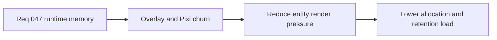

## item_170_reduce_entity_overlay_and_pixi_render_allocation_pressure - Reduce entity-overlay and Pixi-render allocation pressure
> From version: 0.2.3
> Status: Draft
> Understanding: 100%
> Confidence: 97%
> Progress: 0%
> Complexity: High
> Theme: Performance
> Reminder: Update status/understanding/confidence/progress and linked task references when you edit this doc.

# Problem
- Entity overlays and Pixi draw/state churn are plausible contributors to runtime memory pressure.
- Dynamic combat overlays may be creating too much repeated allocation or retained render state.

# Scope
- In: entity overlay rendering, Pixi draw callback churn, text/style reuse, and other high-frequency render allocations.
- Out: combat feature redesign or unrelated shell UI changes.

# Acceptance criteria
- AC1: The slice defines entity-overlay rendering as a memory/perf investigation target.
- AC2: The slice defines reduction of repeated render allocation pressure.
- AC3: The slice keeps player-facing combat readability intact unless profiling proves a simplification is necessary.
- AC4: The slice stays tightly scoped to render pressure.

# Links
- Request: `req_047_define_a_runtime_memory_growth_investigation_and_reduction_wave`

# Notes
- Derived from request `req_047_define_a_runtime_memory_growth_investigation_and_reduction_wave`.
