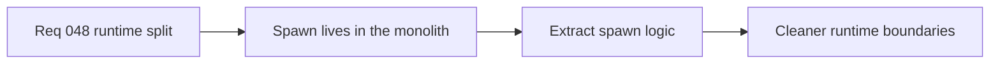

## item_171_extract_runtime_spawn_logic_out_of_entity_simulation - Extract runtime spawn logic out of entity-simulation
> From version: 0.2.3
> Status: Done
> Understanding: 100%
> Confidence: 97%
> Progress: 100%
> Complexity: High
> Theme: Architecture
> Reminder: Update status/understanding/confidence/progress and linked task references when you edit this doc.

# Problem
- Spawn logic currently lives inside the runtime simulation monolith.
- That concentration increases review cost and makes spawn changes collide with unrelated runtime systems.

# Scope
- In: extracting hostile/pickup spawn logic into dedicated runtime-owned modules while preserving behavior.
- Out: gameplay redesign or broader runtime rewrites unrelated to spawn extraction.

# Acceptance criteria
- AC1: The slice defines extraction of spawn logic from `entitySimulation.ts`.
- AC2: The slice preserves current spawn behavior and contracts.
- AC3: The slice keeps the extraction runtime-local and coherent.
- AC4: The slice stays behavior-preserving.

# Links
- Request: `req_048_define_a_structural_runtime_refactor_wave_to_split_the_entity_simulation_monolith`

# Notes
- Derived from request `req_048_define_a_structural_runtime_refactor_wave_to_split_the_entity_simulation_monolith`.
- Delivered in `task_043_orchestrate_runtime_memory_structure_generation_and_settings_polish_wave`.
