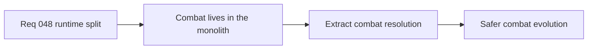

## item_172_extract_runtime_combat_and_damage_resolution_out_of_entity_simulation - Extract runtime combat and damage resolution out of entity-simulation
> From version: 0.2.3
> Status: Draft
> Understanding: 100%
> Confidence: 97%
> Progress: 0%
> Complexity: High
> Theme: Architecture
> Reminder: Update status/understanding/confidence/progress and linked task references when you edit this doc.

# Problem
- Combat, automatic attacks, contact damage, healing, and defeat state are concentrated inside one simulation file.
- That makes combat changes fragile and expensive to review.

# Scope
- In: extraction of combat/damage/healing resolution into dedicated runtime modules.
- Out: combat redesign, balance changes, or new combat mechanics.

# Acceptance criteria
- AC1: The slice defines extraction of combat and damage resolution from `entitySimulation.ts`.
- AC2: The slice preserves current combat behavior and tests.
- AC3: The slice keeps public runtime simulation contracts stable.
- AC4: The slice stays behavior-preserving.

# Links
- Request: `req_048_define_a_structural_runtime_refactor_wave_to_split_the_entity_simulation_monolith`

# Notes
- Derived from request `req_048_define_a_structural_runtime_refactor_wave_to_split_the_entity_simulation_monolith`.
