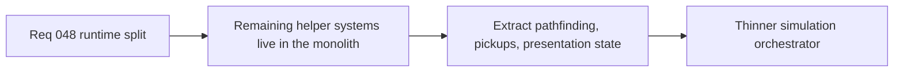

## item_173_extract_runtime_pathfinding_pickups_and_presentation_state_out_of_entity_simulation - Extract runtime pathfinding, pickups, and presentation state out of entity-simulation
> From version: 0.5.0
> Status: Done
> Understanding: 100%
> Confidence: 97%
> Progress: 100%
> Complexity: High
> Theme: Architecture
> Reminder: Update status/understanding/confidence/progress and linked task references when you edit this doc.

# Problem
- Pathfinding, pickup handling, floating damage numbers, and combat presentation state still live in the same monolith.
- These concerns are cohesive enough to extract and are currently coupled too tightly.

# Scope
- In: extraction of pathfinding, pickup logic, and presentation-state helpers into runtime-owned modules.
- Out: new pathfinding features or presentation redesign.

# Acceptance criteria
- AC1: The slice defines extraction of pathfinding, pickup, and presentation-state logic from the monolith.
- AC2: The slice preserves current public behavior and tests.
- AC3: The slice leaves a thinner orchestration layer behind.
- AC4: The slice stays behavior-preserving.

# Request AC Traceability
- req_048_define_a_structural_runtime_refactor_wave_to_split_the_entity_simulation_monolith coverage: AC1, AC2, AC3, AC4, AC5. Proof: `item_173_extract_runtime_pathfinding_pickups_and_presentation_state_out_of_entity_simulation` remains the request-closing backlog slice for `req_048_define_a_structural_runtime_refactor_wave_to_split_the_entity_simulation_monolith` and stays linked to `task_043_orchestrate_runtime_memory_structure_generation_and_settings_polish_wave` for delivered implementation evidence.

# Links
- Request: `req_048_define_a_structural_runtime_refactor_wave_to_split_the_entity_simulation_monolith`

# Notes
- Derived from request `req_048_define_a_structural_runtime_refactor_wave_to_split_the_entity_simulation_monolith`.
- Delivered in `task_043_orchestrate_runtime_memory_structure_generation_and_settings_polish_wave`.
