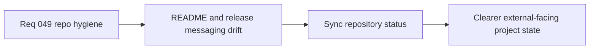

## item_174_synchronize_readme_and_release_facing_repository_status - Synchronize README and release-facing repository status
> From version: 0.2.3
> Status: Draft
> Understanding: 100%
> Confidence: 98%
> Progress: 0%
> Complexity: Medium
> Theme: Delivery
> Reminder: Update status/understanding/confidence/progress and linked task references when you edit this doc.

# Problem
- Release-facing repository status can drift from the true current state.
- README and related release messaging need a coherence pass.

# Scope
- In: README/release-facing sync where current version/status messaging is stale.
- Out: release cut, gameplay work, or architecture refactors.

# Acceptance criteria
- AC1: The slice defines synchronization of README/release-facing status with the real repository state.
- AC2: The slice stays narrow and documentation-focused.
- AC3: The slice avoids bundling unrelated gameplay or implementation work.
- AC4: The slice improves release-facing coherence.

# Links
- Request: `req_049_define_a_documentation_release_and_logics_hygiene_wave_for_repository_coherence`

# Notes
- Derived from request `req_049_define_a_documentation_release_and_logics_hygiene_wave_for_repository_coherence`.
