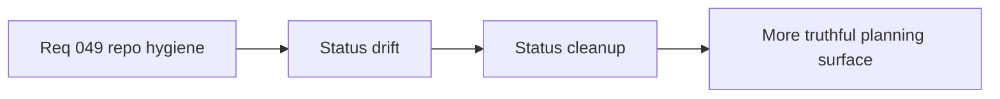

## item_175_clean_up_request_and_task_status_drift_in_recent_waves - Clean up request and task status drift in recent waves
> From version: 0.2.3
> Status: Done
> Understanding: 100%
> Confidence: 98%
> Progress: 100%
> Complexity: Medium
> Theme: Delivery
> Reminder: Update status/understanding/confidence/progress and linked task references when you edit this doc.

# Problem
- Some recent requests/tasks can drift from the true current delivery state, especially when requests are reopened or extended.
- Status truthfulness is part of the repo operating model and needs explicit upkeep.

# Scope
- In: status-hygiene pass for recent requests/tasks/backlog where drift exists.
- Out: historical archival or broad process redesign.

# Acceptance criteria
- AC1: The slice defines cleanup of recent status drift strongly enough to guide implementation.
- AC2: The slice keeps reopened or extended docs honest about their current state.
- AC3: The slice stays narrow and workflow-focused.
- AC4: The slice avoids mixing in unrelated feature delivery.

# Links
- Request: `req_049_define_a_documentation_release_and_logics_hygiene_wave_for_repository_coherence`

# Notes
- Derived from request `req_049_define_a_documentation_release_and_logics_hygiene_wave_for_repository_coherence`.
- Delivered in `task_043_orchestrate_runtime_memory_structure_generation_and_settings_polish_wave`.
