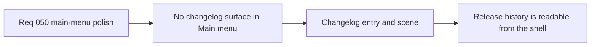

## item_177_define_a_main_menu_changelog_surface_and_release_history_entry - Define a main-menu changelog surface and release-history entry
> From version: 0.3.0
> Status: Draft
> Understanding: 100%
> Confidence: 98%
> Progress: 0%
> Complexity: Medium
> Theme: UI
> Reminder: Update status/understanding/confidence/progress and linked task references when you edit this doc.

# Problem
- The `Main menu` does not yet expose recent release notes or changelog reading as a first-class shell surface.
- The menu still prioritizes `Start new game` ahead of `Load game`, which weakens session continuation posture.

# Scope
- In: a `Changelogs` entry in `Main menu`, a shell-owned changelog-reading scene, and `Load game` reordered before `Start new game`.
- Out: online changelog fetching, full markdown-browser tooling, or broader menu architecture redesign.

# Acceptance criteria
- AC1: The slice defines a `Main menu` entry that opens a shell-owned changelog-reading surface.
- AC2: The slice defines that curated changelog content should come from the local repository corpus.
- AC3: The slice defines that `Load game` should appear before `Start new game`.
- AC4: The slice stays narrowly focused on main-menu reading/access ordering.

# Links
- Request: `req_050_define_a_main_menu_polish_and_first_crystal_xp_progression_wave`

# Notes
- Derived from request `req_050_define_a_main_menu_polish_and_first_crystal_xp_progression_wave`.
