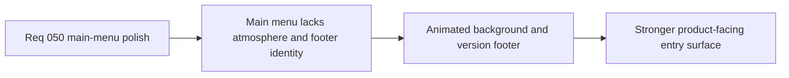

## item_178_define_a_more_atmospheric_main_menu_presentation_with_footer_version_linking - Define a more atmospheric main-menu presentation with footer version linking
> From version: 0.3.0
> Status: Draft
> Understanding: 100%
> Confidence: 98%
> Progress: 0%
> Complexity: Medium
> Theme: UI
> Reminder: Update status/understanding/confidence/progress and linked task references when you edit this doc.

# Problem
- The `Main menu` still feels visually flat and does not present the game as a polished product-facing surface.
- The app name/version is not yet exposed as a compact in-surface affordance linking back to the project GitHub page.

# Scope
- In: animated atmospheric `Main menu` background treatment and a bottom-anchored in-surface footer line with app name/version linking to GitHub.
- Out: shell-wide visual redesign, page-layout footer insertion, or long-form marketing copy.

# Acceptance criteria
- AC1: The slice defines an animated atmospheric background posture for `Main menu`.
- AC2: The slice defines a compact footer line showing app name and version.
- AC3: The slice defines that clicking that footer opens the GitHub project page.
- AC4: The slice defines that the footer must remain a bottom-anchored in-surface overlay, not a DOM layout footer.

# Links
- Request: `req_050_define_a_main_menu_polish_and_first_crystal_xp_progression_wave`

# Notes
- Derived from request `req_050_define_a_main_menu_polish_and_first_crystal_xp_progression_wave`.
