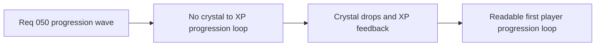

## item_179_define_first_crystal_xp_level_and_runtime_progression_feedback - Define first crystal, XP, level, and runtime progression feedback
> From version: 0.3.0
> Status: Draft
> Understanding: 100%
> Confidence: 98%
> Progress: 0%
> Complexity: High
> Theme: Progression
> Reminder: Update status/understanding/confidence/progress and linked task references when you edit this doc.

# Problem
- Defeated hostiles do not yet produce a clear progression reward.
- The player has no XP/level loop visible in runtime feedback or on pickup collection.

# Scope
- In: crystal drops from defeated hostiles, XP gain on crystal pickup, first level-up posture, and runtime feedback showing XP progress plus level.
- Out: perk trees, class systems, stat-allocation screens, or broader economy redesign.

# Acceptance criteria
- AC1: The slice defines that defeated hostiles drop crystals.
- AC2: The slice defines that crystal pickups grant player XP.
- AC3: The slice defines a first level-up posture for the player.
- AC4: The slice defines that `Runtime feedback` shows current level and `XP current / XP needed`.

# Links
- Request: `req_050_define_a_main_menu_polish_and_first_crystal_xp_progression_wave`

# Notes
- Derived from request `req_050_define_a_main_menu_polish_and_first_crystal_xp_progression_wave`.
