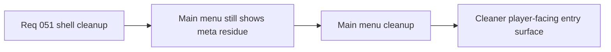

## item_181_define_a_cleaner_main_menu_surface_without_meta_or_session_residue - Define a cleaner main-menu surface without meta or session residue
> From version: 0.3.1
> Status: Draft
> Understanding: 100%
> Confidence: 98%
> Progress: 0%
> Complexity: Medium
> Theme: UX
> Reminder: Update status/understanding/confidence/progress and linked task references when you edit this doc.

# Problem
- The `Main menu` still shows leftover meta/status copy that reads more like shell scaffolding than a player-facing entry surface.
- Session-oriented text and boxed footer chrome add noise without improving player understanding.

# Scope
- In: removing `META FLOW`, removing redundant support copy and `SESSION` information, and simplifying the footer `EMBERWAKE` affordance into a lighter-weight action.
- Out: broader main-menu IA changes, changelog rendering, or new-game naming behavior.

# Acceptance criteria
- AC1: The slice defines removal of `META FLOW` from `Main menu`.
- AC2: The slice defines removal of redundant support/session copy from `Main menu`.
- AC3: The slice defines that the footer `EMBERWAKE` affordance loses its framed button/background treatment while remaining clearly interactive.
- AC4: The slice stays focused on main-menu cleanup rather than broader shell redesign.

# Links
- Request: `req_051_define_a_shell_surface_cleanup_and_view_relative_movement_polish_wave`

# Notes
- Derived from request `req_051_define_a_shell_surface_cleanup_and_view_relative_movement_polish_wave`.
- Source file: `logics/request/req_051_define_a_shell_surface_cleanup_and_view_relative_movement_polish_wave.md`.
