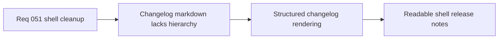

## item_183_define_a_structured_markdown_rendering_posture_for_shell_changelogs - Define a structured markdown-rendering posture for shell changelogs
> From version: 0.3.1
> Status: Draft
> Understanding: 100%
> Confidence: 97%
> Progress: 0%
> Complexity: Medium
> Theme: UX
> Reminder: Update status/understanding/confidence/progress and linked task references when you edit this doc.

# Problem
- The changelog surface still carries leftover shell/meta copy and flattens markdown into weakly structured text.
- Subheadings such as `##` do not yet read as useful hierarchy.

# Scope
- In: removing remaining meta/support copy from `Changelogs` and rendering markdown through structured headings, paragraphs, lists, and light inline emphasis.
- Out: remote changelog fetching, full markdown-browser tooling, or rich document features beyond the curated shell reader.

# Acceptance criteria
- AC1: The slice defines removal of remaining meta/support copy from `Changelogs`, including the `without leaving the shell` phrasing.
- AC2: The slice defines structured rendering for headings, paragraphs, and lists instead of a single preformatted block.
- AC3: The slice defines improved treatment for `##` subheadings so section breaks scan clearly.
- AC4: The slice stays bounded to local curated markdown rendering.

# Links
- Request: `req_051_define_a_shell_surface_cleanup_and_view_relative_movement_polish_wave`

# Notes
- Derived from request `req_051_define_a_shell_surface_cleanup_and_view_relative_movement_polish_wave`.
- Source file: `logics/request/req_051_define_a_shell_surface_cleanup_and_view_relative_movement_polish_wave.md`.
