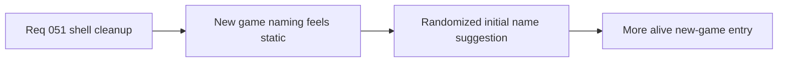

## item_184_define_randomized_initial_character_name_suggestions_for_new_game - Define randomized initial character-name suggestions for new game
> From version: 0.3.1
> Status: Draft
> Understanding: 100%
> Confidence: 97%
> Progress: 0%
> Complexity: Low
> Theme: UX
> Reminder: Update status/understanding/confidence/progress and linked task references when you edit this doc.

# Problem
- `New game` still opens with the same default naming suggestion, which makes the flow feel static and underdesigned.
- The scene also retains leftover `META FLOW` copy that does not belong in player-facing character entry.

# Scope
- In: removing `META FLOW` from `New game` and initializing the scene with a randomized editable name suggestion on each entry.
- Out: full procedural naming systems, deeper character creation, or name-validation redesign.

# Acceptance criteria
- AC1: The slice defines removal of `META FLOW` from `New game`.
- AC2: The slice defines a randomized initial character-name suggestion instead of a fixed fallback such as `Wanderer`.
- AC3: The slice defines that the suggestion rerolls on each scene entry.
- AC4: The slice defines that the suggested name remains fully editable.

# Links
- Request: `req_051_define_a_shell_surface_cleanup_and_view_relative_movement_polish_wave`

# Notes
- Derived from request `req_051_define_a_shell_surface_cleanup_and_view_relative_movement_polish_wave`.
- Source file: `logics/request/req_051_define_a_shell_surface_cleanup_and_view_relative_movement_polish_wave.md`.
