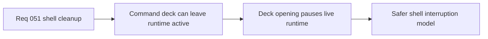

## item_185_define_command_deck_open_behavior_as_a_runtime_pause_trigger - Define command-deck-open behavior as a runtime pause trigger
> From version: 0.3.1
> Status: Done
> Understanding: 100%
> Confidence: 98%
> Progress: 100%
> Complexity: Medium
> Theme: Gameplay
> Reminder: Update status/understanding/confidence/progress and linked task references when you edit this doc.

# Problem
- Opening the `Command deck` during live runtime can leave simulation active under an opened shell control surface.
- That makes the shell feel unsafe and weakens the pause contract.

# Scope
- In: treating command-deck opening during live runtime as a shell-owned pause trigger, and resuming correctly when the deck closes unless another shell scene remains active.
- Out: new pause overlays, broader command-deck redesign, or pause behavior for non-runtime shell scenes.

# Acceptance criteria
- AC1: The slice defines that opening the `Command deck` during live runtime pauses the run through normal shell ownership.
- AC2: The slice defines that this pause behavior applies only when a live runtime session exists.
- AC3: The slice defines that closing the deck returns to the prior live-runtime state unless another shell-owned scene remains active.
- AC4: The slice avoids inventing a separate special-case pause overlay.

# Links
- Request: `req_051_define_a_shell_surface_cleanup_and_view_relative_movement_polish_wave`

# Notes
- Derived from request `req_051_define_a_shell_surface_cleanup_and_view_relative_movement_polish_wave`.
- Source file: `logics/request/req_051_define_a_shell_surface_cleanup_and_view_relative_movement_polish_wave.md`.
