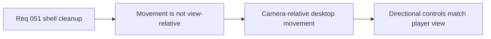

## item_186_define_view_relative_player_movement_under_camera_rotation - Define view-relative player movement under camera rotation
> From version: 0.3.1
> Status: Done
> Understanding: 100%
> Confidence: 98%
> Progress: 100%
> Complexity: Medium
> Theme: Gameplay
> Reminder: Update status/understanding/confidence/progress and linked task references when you edit this doc.

# Problem
- Desktop movement still feels too tied to world axes under rotated camera states.
- This makes movement direction diverge from what the player sees on screen.

# Scope
- In: interpreting desktop keyboard movement relative to current player view/camera rotation before it reaches runtime simulation.
- Out: mobile/touch steering changes, broader camera redesign, or gamepad input work.

# Acceptance criteria
- AC1: The slice defines that desktop movement directions are interpreted relative to current camera/view rotation rather than fixed world axes.
- AC2: The slice defines that pressing right moves screen-right from the player perspective regardless of scene rotation.
- AC3: The slice keeps this first change scoped to desktop keyboard movement.
- AC4: The slice avoids reopening mobile steering or broader camera architecture.

# Links
- Request: `req_051_define_a_shell_surface_cleanup_and_view_relative_movement_polish_wave`

# Notes
- Derived from request `req_051_define_a_shell_surface_cleanup_and_view_relative_movement_polish_wave`.
- Source file: `logics/request/req_051_define_a_shell_surface_cleanup_and_view_relative_movement_polish_wave.md`.
