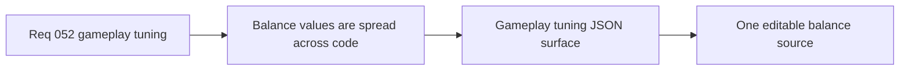

## item_187_define_a_json_owned_gameplay_tuning_surface_for_first_wave_balance_values - Define a JSON-owned gameplay-tuning surface for first-wave balance values
> From version: 0.3.1
> Status: Draft
> Understanding: 100%
> Confidence: 99%
> Progress: 0%
> Complexity: Medium
> Theme: Data
> Reminder: Update status/understanding/confidence/progress and linked task references when you edit this doc.

# Problem
- Gameplay balance numbers such as health, damage, cooldowns, spawn caps, and XP values are still scattered across runtime code modules.
- Balancing therefore requires code search instead of one obvious tuning surface.

# Scope
- In: one repo-owned `gameplayTuning.json` surface covering first-wave hostile, player, pickup, progression, presentation-feel, and optional pathfinding balance knobs.
- Out: replacing all content authoring with JSON, remote config, or in-app editing tools.

# Acceptance criteria
- AC1: The slice defines one JSON-owned gameplay tuning surface for first-wave balance values.
- AC2: The slice defines practical domain grouping such as `hostile`, `player`, `pickup`, and `progression`.
- AC3: The slice defines that frequently adjusted balance numbers move into that surface.
- AC4: The slice stays bounded to tuning data rather than structural content migration.

# Links
- Request: `req_052_define_an_externalized_json_gameplay_tuning_contract`

# Notes
- Derived from request `req_052_define_an_externalized_json_gameplay_tuning_contract`.
- Source file: `logics/request/req_052_define_an_externalized_json_gameplay_tuning_contract.md`.
