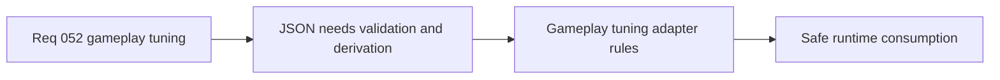

## item_188_define_validation_and_adapter_rules_for_externalized_gameplay_tuning_json - Define validation and adapter rules for externalized gameplay-tuning JSON
> From version: 0.3.1
> Status: Draft
> Understanding: 100%
> Confidence: 99%
> Progress: 0%
> Complexity: Medium
> Theme: Data
> Reminder: Update status/understanding/confidence/progress and linked task references when you edit this doc.

# Problem
- Raw JSON alone would weaken type safety and make bad tuning values easier to ship silently.
- Some gameplay values need derivation before runtime use, such as degrees-to-radians or chunk-relative multipliers.

# Scope
- In: a small TypeScript adapter that loads, validates, and derives runtime-safe gameplay tuning values from JSON.
- Out: schema-platform overbuild, runtime fallback magic, or a generic content system rewrite.

# Acceptance criteria
- AC1: The slice defines a TypeScript adapter boundary between gameplay-tuning JSON and runtime consumers.
- AC2: The slice defines fail-fast validation for invalid or incomplete JSON.
- AC3: The slice defines how derived values such as radians or chunk-relative world units are resolved.
- AC4: The slice preserves runtime-safe typed access rather than raw JSON consumption.

# Links
- Request: `req_052_define_an_externalized_json_gameplay_tuning_contract`

# Notes
- Derived from request `req_052_define_an_externalized_json_gameplay_tuning_contract`.
- Source file: `logics/request/req_052_define_an_externalized_json_gameplay_tuning_contract.md`.
