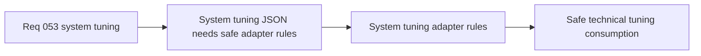

## item_192_define_validation_and_adapter_rules_for_externalized_system_tuning_json - Define validation and adapter rules for externalized system-tuning JSON
> From version: 0.3.1
> Status: Draft
> Understanding: 100%
> Confidence: 99%
> Progress: 0%
> Complexity: Medium
> Theme: Data
> Reminder: Update status/understanding/confidence/progress and linked task references when you edit this doc.

# Problem
- Raw technical-tuning JSON would otherwise push unsafe or malformed values directly into runtime systems.
- Some technical values need derivation or normalization before use.

# Scope
- In: a TypeScript adapter that validates, derives, and exposes runtime-safe system-tuning values from JSON.
- Out: env overrides, platform-wide schema tooling, or generic constant registries.

# Acceptance criteria
- AC1: The slice defines a TypeScript adapter boundary for `systemTuning.json`.
- AC2: The slice defines fail-fast validation for invalid or incomplete technical tuning data.
- AC3: The slice defines how friendly authored units are converted into runtime-safe values when needed.
- AC4: The slice preserves typed runtime access rather than raw JSON reads.

# Links
- Request: `req_053_define_an_externalized_json_system_tuning_contract`

# Notes
- Derived from request `req_053_define_an_externalized_json_system_tuning_contract`.
- Source file: `logics/request/req_053_define_an_externalized_json_system_tuning_contract.md`.
