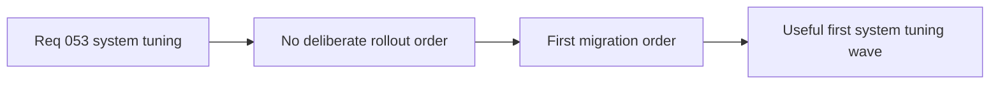

## item_194_define_a_first_rollout_for_input_viewport_pathfinding_and_runtime_presentation_tuning - Define a first rollout for input, viewport, pathfinding, and runtime-presentation tuning
> From version: 0.5.0
> Status: Done
> Understanding: 100%
> Confidence: 98%
> Progress: 100%
> Complexity: Medium
> Theme: Data
> Reminder: Update status/understanding/confidence/progress and linked task references when you edit this doc.

# Problem
- The system-tuning contract risks becoming too broad if every semi-technical constant moves at once.
- The project needs a deliberate first rollout order for the highest-value technical tuning domains.

# Scope
- In: first-wave migration order for `input`, `viewport`, `runtimePresentation`, `hostilePathfinding`, and optionally `movementSurfaceModifiers`.
- Out: camera/view tuning in the first migration, or migrating every technical constant immediately.

# Acceptance criteria
- AC1: The slice defines `input` and `viewport` as first-wave migration domains.
- AC2: The slice defines `runtimePresentation` and `hostilePathfinding` as subsequent domains once the first wave lands.
- AC3: The slice defines `movementSurfaceModifiers` as optional follow-up rather than mandatory first-wave scope.
- AC4: The slice keeps camera/view tuning outside the first migration.

# Request AC Traceability
- req_053_define_an_externalized_json_system_tuning_contract coverage: AC1, AC10, AC2, AC3, AC4, AC5, AC6, AC7, AC8, AC9. Proof: `item_194_define_a_first_rollout_for_input_viewport_pathfinding_and_runtime_presentation_tuning` remains the request-closing backlog slice for `req_053_define_an_externalized_json_system_tuning_contract` and stays linked to `task_045_orchestrate_shell_cleanup_and_externalized_tuning_contracts_wave` for delivered implementation evidence.

# Links
- Request: `req_053_define_an_externalized_json_system_tuning_contract`

# Notes
- Derived from request `req_053_define_an_externalized_json_system_tuning_contract`.
- Source file: `logics/request/req_053_define_an_externalized_json_system_tuning_contract.md`.
