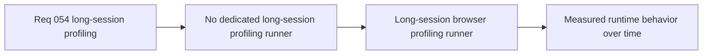

## item_197_define_a_long_session_browser_profiling_runner_for_memory_and_runtime_metrics - Define a long-session browser profiling runner for memory and runtime metrics
> From version: 0.3.1
> Status: Done
> Understanding: 100%
> Confidence: 99%
> Progress: 100%
> Complexity: High
> Theme: Performance
> Reminder: Update status/understanding/confidence/progress and linked task references when you edit this doc.

# Problem
- The current short smoke runner is not designed to profile runtime memory or behavior over `30s`, `2m`, or `5m` sessions.
- Suspected long-session leaks and slower runtime regressions therefore lack a dedicated browser-side profiling runner.

# Scope
- In: a separate long-session browser profiling runner that executes scripted runtime scenarios, samples browser/runtime metrics at intervals, and remains outside normal fast smoke validation by default.
- Out: collapsing this work into the short smoke suite, mandating deep heap snapshots in every run, or immediately enforcing strict failure budgets before a stable baseline exists.

# Acceptance criteria
- AC1: The slice defines a dedicated long-session browser profiling runner separate from the short smoke check.
- AC2: The slice defines support for durations meaningfully longer than the current smoke interaction window.
- AC3: The slice defines interval sampling of browser-side memory or runtime signals over time.
- AC4: The slice defines that hard failure budgets are not required in the first rollout before a baseline exists.
- AC5: The slice keeps the runner outside normal CI by default while remaining compatible with later dedicated jobs.

# Links
- Request: `req_054_define_a_scripted_long_session_runtime_profiling_and_player_simulation_harness`

# Notes
- Derived from request `req_054_define_a_scripted_long_session_runtime_profiling_and_player_simulation_harness`.
- Source file: `logics/request/req_054_define_a_scripted_long_session_runtime_profiling_and_player_simulation_harness.md`.
