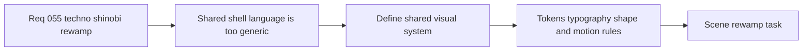

## item_199_define_a_techno_shinobi_visual_system_for_shell_menus_and_runtime_chrome - Define a techno shinobi visual system for shell menus and runtime chrome
> From version: 0.3.2
> Status: Ready
> Understanding: 98%
> Confidence: 95%
> Progress: 0%
> Complexity: High
> Theme: UI
> Reminder: Update status/understanding/confidence/progress and linked task references when you edit this doc.

# Problem
- The shell family currently shares one dark translucent panel language across menus, HUD, and runtime chrome, so scene identity depends too much on copy instead of composition and component role.
- The palette and typography already suggest tactical sci-fi, but they do not yet define a more ownable `Techno-shinobi` system with strict rules for signal colors, shape language, and emphasis.
- Without a shared visual system, scene-level rewamps risk drifting into unrelated one-off treatments instead of forming one coherent Emberwake shell family.

# Scope
- In: defining the shared `Techno-shinobi` visual system for shell surfaces, including palette rules, typography posture, shape/radius posture, border and highlight language, motion rules, component tiers, and mobile density constraints.
- In: defining how shared building blocks such as `shell-control`, scene headers, section headers, action modules, utility rows, and status tags should behave across the menu family.
- Out: final scene-specific layout composition for `Main menu`, `Command deck`, `Settings`, `Changelogs`, `Defeat`, `Victory`, or HUD placement details beyond what the shared system requires.
- Out: changing shell/runtime ownership logic, save/load logic, or gameplay systems.

# Acceptance criteria
- AC1: The slice defines a shared `Techno-shinobi` visual system with concrete palette, contrast, and signal-color rules for shell menus and runtime chrome.
- AC2: The slice defines typography rules that reduce all-caps overuse and clarify heading, label, metadata, and action roles.
- AC3: The slice defines shape and surface rules for cards, buttons, modules, rails, borders, and highlights so the shell no longer depends on one repeated rounded translucent panel treatment.
- AC4: The slice defines motion and emphasis rules that stay restrained and avoid floaty/glossy cyberpunk cliches.
- AC5: The slice defines mobile density constraints and stacking rules so the redesign does not degrade into repetitive piles of identical cards.
- AC6: The slice stays focused on shared visual-system foundations rather than replacing scene-specific composition work.

# AC Traceability
- AC1 -> Scope: Shared palette and signal-color rules are documented for shell menus and runtime chrome. Proof target: `src/app/styles/theme.css`, shell style documentation, rewamp implementation notes.
- AC2 -> Scope: Typography roles are defined for headings, labels, metadata, and actions. Proof target: shared shell styles and updated menu typography.
- AC3 -> Scope: Shape and surface rules are defined for reusable shell components. Proof target: `src/app/styles/app.css`, shared component classes.
- AC4 -> Scope: Motion and emphasis rules stay restrained and product-native. Proof target: updated hover/focus/reveal behavior in shared styles.
- AC5 -> Scope: Mobile constraints are defined for density and stacked layouts. Proof target: mobile shell CSS and manual viewport verification.
- AC6 -> Scope: Scene-specific layout work remains outside this slice except where needed to validate the shared system. Proof target: backlog split boundaries and orchestration task plan.

# Decision framing
- Product framing: Required
- Product signals: navigation and discoverability, engagement loop, experience scope
- Product follow-up: Create or link a product brief before implementation moves deeper into delivery.
- Architecture framing: Consider
- Architecture signals: runtime and boundaries
- Architecture follow-up: Review whether an architecture decision is needed before implementation becomes harder to reverse.

# Links
- Product brief(s): `prod_001_minimal_overlay_and_feedback_for_early_runtime`, `prod_003_high_density_top_down_survival_action_direction`, `prod_005_visual_identity_dark_fantasy_with_synthetic_energy_accents`
- Architecture decision(s): `adr_016_define_shell_scene_state_and_meta_surface_ownership`, `adr_022_keep_product_meta_flow_shell_owned_while_runtime_state_remains_game_preserved`
- Request: `req_055_rework_all_shell_menus_with_a_techno_shinobi_visual_direction`
- Primary task(s): `task_047_orchestrate_techno_shinobi_shell_menu_rewamp_wave`

# References
- `logics/skills/logics-ui-steering/SKILL.md`
- `src/app/styles/theme.css`
- `src/app/styles/app.css`

# Priority
- Impact: High
- Urgency: Medium

# Notes
- Derived from request `req_055_rework_all_shell_menus_with_a_techno_shinobi_visual_direction`.
- Source file: `logics/request/req_055_rework_all_shell_menus_with_a_techno_shinobi_visual_direction.md`.
- Request context seeded into this backlog item from `logics/request/req_055_rework_all_shell_menus_with_a_techno_shinobi_visual_direction.md`.
