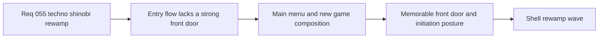

## item_200_define_a_stronger_front_door_composition_for_main_menu_and_new_game_initiation - Define a stronger front-door composition for main menu and new game initiation
> From version: 0.3.2
> Status: Done
> Understanding: 98%
> Confidence: 100%
> Progress: 100%
> Complexity: High
> Theme: UI
> Reminder: Update status/understanding/confidence/progress and linked task references when you edit this doc.

# Problem
- `Main menu` and `New game` are functionally correct, but they still read as generic centered shell cards with stacked actions instead of a memorable front door and a ritualized run-entry sequence.
- Primary actions such as `Resume runtime`, `Start new game`, and `Begin` do not yet benefit from a composition that clearly separates entry, continuation, and preparation states.
- The first player-facing impression of the game therefore undersells the shell’s role as product hub and weakens the intended `Techno-shinobi` identity.

# Scope
- In: redefining the composition, hierarchy, and action emphasis of `Main menu` and `New game` so they read as a stronger front door and initiation flow.
- In: defining how title, support copy, footer/version affordances, action ordering, and the name-entry form should visually stage the start of a run.
- Out: changing session rules, save-slot logic, character-name validation rules, or broader settings/changelog layouts outside the entry flow.

# Acceptance criteria
- AC1: The slice defines a more memorable `Main menu` composition with stronger front-door identity than the current single centered card posture.
- AC2: The slice defines a clearer action hierarchy for `Resume`, `Load game`, `Start new game`, `Settings`, and `Changelogs`.
- AC3: The slice defines `New game` as an initiation surface rather than a lightweight form drop-in, while preserving the existing shell-owned flow.
- AC4: The slice defines how the character-name field, helper copy, and `Begin` CTA should support the `Techno-shinobi` identity without becoming theatrical clutter.
- AC5: The slice defines desktop and mobile entry-flow layouts that preserve hierarchy and avoid repetitive full-width button stacks where unnecessary.
- AC6: The slice stays focused on front-door composition and does not reopen session ownership or validation logic redesign.

# AC Traceability
- AC1 -> Scope: `Main menu` receives a stronger front-door composition. Proof target: `src/app/components/AppMetaScenePanel.tsx`, shell scene CSS, manual shell-scene review.
- AC2 -> Scope: Entry actions have a clearer visual order and emphasis. Proof target: main-menu action layout and CTA treatment.
- AC3 -> Scope: `New game` reads as run initiation rather than a basic form insertion. Proof target: new-game scene composition and action framing.
- AC4 -> Scope: name-entry field and CTA support the visual direction without noise. Proof target: new-game field treatment and helper/error posture.
- AC5 -> Scope: mobile and desktop preserve hierarchy during entry flow. Proof target: responsive shell scene CSS and manual viewport verification.
- AC6 -> Scope: session and validation logic remain unchanged except for presentation clarifications. Proof target: unchanged route/behavior logic and backlog boundaries.

# Decision framing
- Product framing: Required
- Product signals: navigation and discoverability, engagement loop, experience scope
- Product follow-up: Create or link a product brief before implementation moves deeper into delivery.
- Architecture framing: Consider
- Architecture signals: runtime and boundaries
- Architecture follow-up: Review whether an architecture decision is needed before implementation becomes harder to reverse.

# Links
- Product brief(s): `prod_001_minimal_overlay_and_feedback_for_early_runtime`, `prod_003_high_density_top_down_survival_action_direction`, `prod_005_visual_identity_dark_fantasy_with_synthetic_energy_accents`
- Architecture decision(s): `adr_016_define_shell_scene_state_and_meta_surface_ownership`, `adr_022_keep_product_meta_flow_shell_owned_while_runtime_state_remains_game_preserved`
- Request: `req_055_rework_all_shell_menus_with_a_techno_shinobi_visual_direction`
- Primary task(s): `task_047_orchestrate_techno_shinobi_shell_menu_rewamp_wave`

# References
- `logics/skills/logics-ui-steering/SKILL.md`
- `src/app/components/AppMetaScenePanel.tsx`
- `src/app/styles/app.css`

# Priority
- Impact: High
- Urgency: High

# Notes
- Derived from request `req_055_rework_all_shell_menus_with_a_techno_shinobi_visual_direction`.
- Source file: `logics/request/req_055_rework_all_shell_menus_with_a_techno_shinobi_visual_direction.md`.
- Request context seeded into this backlog item from `logics/request/req_055_rework_all_shell_menus_with_a_techno_shinobi_visual_direction.md`.
- Implemented in `task_047_orchestrate_techno_shinobi_shell_menu_rewamp_wave` through the rewamped `Main menu` and `New game` composition in `src/app/components/AppMetaScenePanel.tsx` and `src/app/styles/app.css`.
