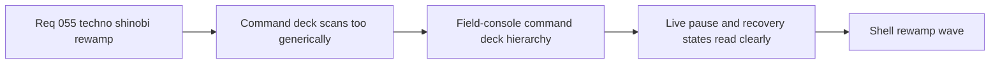

## item_201_define_a_field_console_command_deck_hierarchy_for_runtime_controls - Define a field-console command deck hierarchy for runtime controls
> From version: 0.3.2
> Status: Done
> Understanding: 98%
> Confidence: 100%
> Progress: 100%
> Complexity: High
> Theme: UI
> Reminder: Update status/understanding/confidence/progress and linked task references when you edit this doc.

# Problem
- The runtime `Command deck` currently relies on repeated stacked rows, subdued state labels, and near-uniform item treatments, which weakens scanning and scene awareness.
- The deck is functionally rich, but it still feels like a generic shell list rather than a field-console surface with deliberate control groupings and runtime posture.
- Mobile behavior exists, yet the bottom-sheet adaptation still inherits the same card stack language instead of a stronger console module identity.

# Scope
- In: redefining the runtime `Command deck` hierarchy, trigger posture, root-vs-subscreen grouping, primary action treatment, utility treatment, and mobile sheet behavior inside the existing command-deck flow.
- In: defining how live runtime state, paused state, recovery state, and settings/view/tool subsections should differ visually without changing their core availability rules.
- Out: introducing new runtime control features, changing pause ownership rules, or redesigning unrelated shell scenes.

# Acceptance criteria
- AC1: The slice defines a clearer hierarchy for the runtime `Command deck`, including the trigger, primary action module, section headers, utility rows, and submenus.
- AC2: The slice defines distinct visual treatment for runtime states such as live, paused, recovery, and settings/view/tool navigation.
- AC3: The slice defines a stronger field-console posture for the mobile bottom-sheet variant without diverging from the desktop deck.
- AC4: The slice defines which controls should read as primary, secondary, utility, or diagnostic affordances.
- AC5: The slice preserves current capability and shell/runtime semantics while focusing on layout, hierarchy, and presentation.
- AC6: The slice stays scoped to command-deck structure and does not absorb broader HUD or main-menu redesign work.

# AC Traceability
- AC1 -> Scope: Command-deck hierarchy is redefined across trigger, primary action, sections, and submenus. Proof target: `src/app/components/ShellMenu.tsx`, `src/app/styles/app.css`.
- AC2 -> Scope: live, paused, recovery, and settings/view/tool states read differently. Proof target: scene-state styling and content grouping inside the deck.
- AC3 -> Scope: mobile bottom sheet keeps a stronger field-console posture. Proof target: mobile deck CSS and manual viewport verification.
- AC4 -> Scope: primary vs secondary vs utility affordances are explicitly differentiated. Proof target: deck item variants and action grouping.
- AC5 -> Scope: existing runtime semantics remain intact while presentation changes. Proof target: unchanged control behavior and deck interactions.
- AC6 -> Scope: HUD and other scenes remain outside this slice. Proof target: backlog boundaries and orchestration task references.

# Decision framing
- Product framing: Required
- Product signals: navigation and discoverability, engagement loop, experience scope
- Product follow-up: Create or link a product brief before implementation moves deeper into delivery.
- Architecture framing: Consider
- Architecture signals: runtime and boundaries
- Architecture follow-up: Review whether an architecture decision is needed before implementation becomes harder to reverse.

# Links
- Product brief(s): `prod_001_minimal_overlay_and_feedback_for_early_runtime`, `prod_003_high_density_top_down_survival_action_direction`, `prod_005_visual_identity_dark_fantasy_with_synthetic_energy_accents`
- Architecture decision(s): `adr_016_define_shell_scene_state_and_meta_surface_ownership`, `adr_022_keep_product_meta_flow_shell_owned_while_runtime_state_remains_game_preserved`
- Request: `req_055_rework_all_shell_menus_with_a_techno_shinobi_visual_direction`
- Primary task(s): `task_047_orchestrate_techno_shinobi_shell_menu_rewamp_wave`

# References
- `logics/skills/logics-ui-steering/SKILL.md`
- `src/app/components/ShellMenu.tsx`
- `src/app/styles/app.css`

# Priority
- Impact: High
- Urgency: High

# Notes
- Derived from request `req_055_rework_all_shell_menus_with_a_techno_shinobi_visual_direction`.
- Source file: `logics/request/req_055_rework_all_shell_menus_with_a_techno_shinobi_visual_direction.md`.
- Request context seeded into this backlog item from `logics/request/req_055_rework_all_shell_menus_with_a_techno_shinobi_visual_direction.md`.
- Implemented in `task_047_orchestrate_techno_shinobi_shell_menu_rewamp_wave` through the `ShellMenu` hierarchy rewrite and the lazy-loaded command-deck CSS in `src/app/components/ShellMenu.tsx` and `src/app/components/ActiveRuntimeShellContent.css`.
