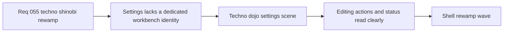

## item_202_define_a_techno_dojo_settings_scene_for_desktop_control_editing - Define a techno dojo settings scene for desktop-control editing
> From version: 0.3.2
> Status: Ready
> Understanding: 98%
> Confidence: 95%
> Progress: 0%
> Complexity: Medium
> Theme: UI
> Reminder: Update status/understanding/confidence/progress and linked task references when you edit this doc.

# Problem
- The `Settings` scene already has useful grouping for desktop control editing, but it still inherits too much of the generic shell-card language and does not yet feel like a specialized technical workbench.
- Binding capture, conflict feedback, and action-state semantics are functional, yet the panel still lacks a stronger `Techno dojo` posture that separates editing, status, and navigation roles more deliberately.
- Without a dedicated settings treatment, this scene risks feeling visually interchangeable with unrelated shell surfaces.

# Scope
- In: redefining the `Settings` scene composition and the `Desktop controls` section so the surface reads as a disciplined technical workbench within the `Techno-shinobi` family.
- In: clarifying movement-vs-camera grouping, capture state emphasis, conflict/error posture, and the hierarchy between `Apply controls`, `Revert`, `Reset defaults`, and `Back to menu`.
- Out: changing rebinding rules, persistence logic, or introducing new settings categories beyond the current desktop-control scope.

# Acceptance criteria
- AC1: The slice defines a more specialized `Settings` scene identity that reads as a technical workbench rather than a generic shell card.
- AC2: The slice defines a clearer hierarchy between section title, status/capture messaging, binding groups, and bottom actions.
- AC3: The slice defines how capture and conflict states should surface visually without overwhelming the primary editing flow.
- AC4: The slice defines desktop and mobile settings layouts that preserve clarity while keeping the panel compact and usable.
- AC5: The slice preserves the current rebinding behavior and focuses on presentation, hierarchy, and scene posture.
- AC6: The slice stays scoped to the existing `Settings > Desktop controls` surface and does not expand into unrelated settings domains.

# AC Traceability
- AC1 -> Scope: `Settings` gains a dedicated workbench identity. Proof target: `src/app/components/AppMetaScenePanel.tsx`, `src/app/components/DesktopControlSettingsSection.tsx`, related CSS.
- AC2 -> Scope: title, status, groups, and bottom actions are visually reordered and clarified. Proof target: settings scene layout and controls CSS.
- AC3 -> Scope: capture and conflict states gain clearer feedback posture. Proof target: binding capture styling and conflict indicators.
- AC4 -> Scope: responsive settings layout remains compact and usable. Proof target: settings CSS and manual mobile/desktop verification.
- AC5 -> Scope: rebinding logic remains intact while presentation changes. Proof target: existing settings behavior and tests.
- AC6 -> Scope: the slice stays within current desktop-control scope. Proof target: unchanged settings domain boundaries.

# Decision framing
- Product framing: Required
- Product signals: navigation and discoverability, engagement loop, experience scope
- Product follow-up: Create or link a product brief before implementation moves deeper into delivery.
- Architecture framing: Consider
- Architecture signals: runtime and boundaries
- Architecture follow-up: Review whether an architecture decision is needed before implementation becomes harder to reverse.

# Links
- Product brief(s): `prod_001_minimal_overlay_and_feedback_for_early_runtime`, `prod_003_high_density_top_down_survival_action_direction`, `prod_005_visual_identity_dark_fantasy_with_synthetic_energy_accents`
- Architecture decision(s): `adr_016_define_shell_scene_state_and_meta_surface_ownership`, `adr_022_keep_product_meta_flow_shell_owned_while_runtime_state_remains_game_preserved`
- Request: `req_055_rework_all_shell_menus_with_a_techno_shinobi_visual_direction`
- Primary task(s): `task_047_orchestrate_techno_shinobi_shell_menu_rewamp_wave`

# References
- `logics/skills/logics-ui-steering/SKILL.md`
- `src/app/components/AppMetaScenePanel.tsx`
- `src/app/components/DesktopControlSettingsSection.tsx`
- `src/app/components/DesktopControlSettingsSection.css`

# Priority
- Impact: Medium
- Urgency: Medium

# Notes
- Derived from request `req_055_rework_all_shell_menus_with_a_techno_shinobi_visual_direction`.
- Source file: `logics/request/req_055_rework_all_shell_menus_with_a_techno_shinobi_visual_direction.md`.
- Request context seeded into this backlog item from `logics/request/req_055_rework_all_shell_menus_with_a_techno_shinobi_visual_direction.md`.
