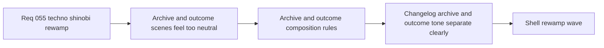

## item_203_define_archive_and_outcome_scene_composition_rules_for_changelogs_defeat_and_victory - Define archive and outcome scene composition rules for changelogs defeat and victory
> From version: 0.3.2
> Status: Ready
> Understanding: 98%
> Confidence: 95%
> Progress: 0%
> Complexity: Medium
> Theme: UI
> Reminder: Update status/understanding/confidence/progress and linked task references when you edit this doc.

# Problem
- `Changelogs`, `Defeat`, and `Victory` currently share too much of the same neutral panel language, so archive reading and gameplay outcomes lack their own pacing and emotional weight.
- The changelog reader is readable, but it does not yet feel like an archive surface inside the same family; the outcome scenes are functional, but their tone is not distinct enough from neutral shell states.
- Without scene-specific composition rules, these surfaces remain visually interchangeable and weaken the value of the broader rewamp.

# Scope
- In: defining archive-specific composition rules for `Changelogs` and outcome-specific composition rules for `Defeat` and `Victory`.
- In: defining header posture, metadata treatment, card structure, recap emphasis, action framing, and scroll/container behavior for these scenes.
- Out: changing changelog data sources, markdown parsing logic, defeat/victory gameplay rules, or unrelated HUD/command-deck work.

# Acceptance criteria
- AC1: The slice defines an archive treatment for `Changelogs` that feels quieter and more editorial than the rest of the shell menu family while staying visually related.
- AC2: The slice defines differentiated tone and composition for `Defeat` and `Victory` so outcome scenes no longer read like neutral settings-like cards.
- AC3: The slice defines how recap facts, release-note metadata, and return/continue actions should be framed in each scene.
- AC4: The slice defines responsive container and scroll posture for these scenes on constrained viewports.
- AC5: The slice preserves existing scene ownership and content sources while focusing on visual and interaction-language differentiation.
- AC6: The slice stays scoped to `Changelogs`, `Defeat`, and `Victory` rather than reopening `Main menu`, `Settings`, or command-deck redesign.

# AC Traceability
- AC1 -> Scope: `Changelogs` receives an archive-specific treatment. Proof target: changelog scene composition, markdown card presentation, responsive layout.
- AC2 -> Scope: `Defeat` and `Victory` receive differentiated visual tone and pacing. Proof target: outcome scene layout and action framing in `AppMetaScenePanel`.
- AC3 -> Scope: facts, metadata, and actions are framed per scene. Proof target: per-scene component layout and styling.
- AC4 -> Scope: constrained viewport behavior remains usable. Proof target: responsive scene CSS and manual viewport verification.
- AC5 -> Scope: existing scene ownership and content sources remain intact. Proof target: unchanged data/logic behavior.
- AC6 -> Scope: other shell scenes stay outside this slice. Proof target: backlog split boundaries and orchestration task links.

# Decision framing
- Product framing: Required
- Product signals: navigation and discoverability, engagement loop, experience scope
- Product follow-up: Create or link a product brief before implementation moves deeper into delivery.
- Architecture framing: Consider
- Architecture signals: runtime and boundaries
- Architecture follow-up: Review whether an architecture decision is needed before implementation becomes harder to reverse.

# Links
- Product brief(s): `prod_001_minimal_overlay_and_feedback_for_early_runtime`, `prod_003_high_density_top_down_survival_action_direction`, `prod_005_visual_identity_dark_fantasy_with_synthetic_energy_accents`
- Architecture decision(s): `adr_016_define_shell_scene_state_and_meta_surface_ownership`, `adr_022_keep_product_meta_flow_shell_owned_while_runtime_state_remains_game_preserved`
- Request: `req_055_rework_all_shell_menus_with_a_techno_shinobi_visual_direction`
- Primary task(s): `task_047_orchestrate_techno_shinobi_shell_menu_rewamp_wave`

# References
- `logics/skills/logics-ui-steering/SKILL.md`
- `src/app/components/AppMetaScenePanel.tsx`
- `src/app/styles/app.css`

# Priority
- Impact: Medium
- Urgency: Medium

# Notes
- Derived from request `req_055_rework_all_shell_menus_with_a_techno_shinobi_visual_direction`.
- Source file: `logics/request/req_055_rework_all_shell_menus_with_a_techno_shinobi_visual_direction.md`.
- Request context seeded into this backlog item from `logics/request/req_055_rework_all_shell_menus_with_a_techno_shinobi_visual_direction.md`.
