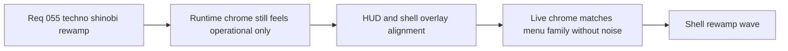

## item_204_define_player_hud_and_shell_overlay_alignment_within_the_techno_shinobi_menu_family - Define player HUD and shell overlay alignment within the techno shinobi menu family
> From version: 0.3.2
> Status: Done
> Understanding: 98%
> Confidence: 100%
> Progress: 100%
> Complexity: Medium
> Theme: UI
> Reminder: Update status/understanding/confidence/progress and linked task references when you edit this doc.

# Problem
- The runtime HUD and adjacent overlays are readable, but they still feel closer to operational telemetry than to a player-facing chrome that belongs to the same family as the rewamped shell menus.
- If the menu family gets a stronger identity while the HUD, inspection, and adjacent overlays keep their current posture, the shell will still feel visually split between menus and live runtime surfaces.
- This slice is needed to keep player-facing runtime chrome aligned with the broader `Techno-shinobi` system without turning the hot path into decorative UI.

# Scope
- In: aligning the player HUD and adjacent player-facing shell overlays with the `Techno-shinobi` family through typography, spacing, surface language, signal-color rules, and grouping posture.
- In: defining which supporting overlays should inherit the shared chrome language directly and which debug-heavy surfaces should only receive minimal family alignment.
- Out: deep diagnostics-panel redesign, gameplay metric changes, or unrelated menu-scene composition work.

# Acceptance criteria
- AC1: The slice defines how the player HUD should align with the `Techno-shinobi` family while remaining compact, legible, and gameplay-first.
- AC2: The slice defines which adjacent overlays should share the new chrome language directly and which should stay quieter because they are diagnostics-oriented.
- AC3: The slice defines hierarchy rules for player-name, health, XP, currency, runtime hints, and related readouts so they feel more product-native than telemetry-heavy.
- AC4: The slice defines desktop and mobile runtime-chrome expectations that keep overlays readable without overbuilding decorative framing.
- AC5: The slice preserves runtime hot-path clarity and avoids turning player-facing overlays into heavy dashboard chrome.
- AC6: The slice stays scoped to HUD and overlay alignment rather than absorbing the main command-deck or menu-scene rewamps.

# AC Traceability
- AC1 -> Scope: player HUD alignment rules are defined without bloating gameplay chrome. Proof target: `src/app/components/PlayerHudCard.tsx`, related CSS, runtime chrome implementation notes.
- AC2 -> Scope: overlay inheritance rules are defined for player-facing vs diagnostics-oriented surfaces. Proof target: overlay CSS and scene-level chrome decisions.
- AC3 -> Scope: runtime readout hierarchy is clarified. Proof target: HUD content order, labels, and emphasis treatment.
- AC4 -> Scope: runtime chrome remains readable on mobile and desktop. Proof target: responsive overlay CSS and manual viewport verification.
- AC5 -> Scope: hot-path clarity stays primary. Proof target: compact HUD/overlay treatment and manual runtime review.
- AC6 -> Scope: command deck and menu scenes remain outside this slice. Proof target: backlog boundaries and orchestration task references.

# Decision framing
- Product framing: Required
- Product signals: navigation and discoverability, engagement loop, experience scope
- Product follow-up: Create or link a product brief before implementation moves deeper into delivery.
- Architecture framing: Consider
- Architecture signals: runtime and boundaries
- Architecture follow-up: Review whether an architecture decision is needed before implementation becomes harder to reverse.

# Links
- Product brief(s): `prod_001_minimal_overlay_and_feedback_for_early_runtime`, `prod_003_high_density_top_down_survival_action_direction`, `prod_005_visual_identity_dark_fantasy_with_synthetic_energy_accents`
- Architecture decision(s): `adr_016_define_shell_scene_state_and_meta_surface_ownership`, `adr_022_keep_product_meta_flow_shell_owned_while_runtime_state_remains_game_preserved`
- Request: `req_055_rework_all_shell_menus_with_a_techno_shinobi_visual_direction`
- Primary task(s): `task_047_orchestrate_techno_shinobi_shell_menu_rewamp_wave`

# References
- `logics/skills/logics-ui-steering/SKILL.md`
- `src/app/components/PlayerHudCard.tsx`
- `src/app/components/PlayerHudCard.css`
- `src/app/components/ActiveRuntimeShellContent.css`

# Priority
- Impact: Medium
- Urgency: Medium

# Notes
- Derived from request `req_055_rework_all_shell_menus_with_a_techno_shinobi_visual_direction`.
- Source file: `logics/request/req_055_rework_all_shell_menus_with_a_techno_shinobi_visual_direction.md`.
- Request context seeded into this backlog item from `logics/request/req_055_rework_all_shell_menus_with_a_techno_shinobi_visual_direction.md`.
- Implemented in `task_047_orchestrate_techno_shinobi_shell_menu_rewamp_wave` through the HUD rewrite and adjacent overlay alignment in `src/app/components/PlayerHudCard.tsx`, `src/app/components/PlayerHudCard.css`, and `src/app/components/ActiveRuntimeShellContent.css`.
