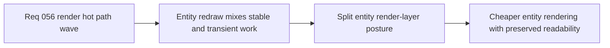

## item_206_define_a_split_entity_render_layer_posture_for_stable_shapes_and_transient_combat_fx - Define a split entity render-layer posture for stable shapes and transient combat FX
> From version: 0.3.2
> Status: Draft
> Understanding: 96%
> Confidence: 90%
> Progress: 0%
> Complexity: High
> Theme: Performance
> Reminder: Update status/understanding/confidence/progress and linked task references when you edit this doc.

# Problem
- Entity drawing currently packs stable body shapes, orientation lines, bars, hit reactions, attack arcs, and floating combat feedback into a dense redraw posture.
- That makes every visible combatant more expensive than necessary and makes future combat readability additions harder to add safely.
- This slice is needed to separate stable entity visuals from fast-changing combat overlays so the entity hot path becomes cheaper and easier to reason about.

# Scope
- In: defining a render-layer posture that separates stable entity visuals from transient combat FX and per-tick overlays.
- In: defining which entity sub-elements must remain live, which can be simplified, and which should be conditionally shown.
- Out: gameplay-system tuning, world/chunk caching, or shell/HUD chrome work.

# Acceptance criteria
- AC1: The slice defines a split between stable entity visuals and transient combat or feedback visuals.
- AC2: The slice defines which entity sub-elements belong in the always-on player path and which should be isolated, simplified, or conditional.
- AC3: The slice preserves essential combat readability for player and hostile entities while lowering redraw density.
- AC4: The slice stays compatible with the current Pixi/runtime ownership model and does not widen into combat-system redesign.
- AC5: The slice defines validation against the scripted profiling scenarios after implementation.

# AC Traceability
- AC1 -> Scope: stable/transient layer split is explicit. Proof target: entity render structure, linked ADR text, changed render components.
- AC2 -> Scope: sub-element ownership rules are defined. Proof target: documented bars/arcs/hit reactions/floating-number posture.
- AC3 -> Scope: readability remains intentional. Proof target: runtime visual review and acceptance notes.
- AC4 -> Scope: ownership and renderer stack remain intact. Proof target: architecture refs and module boundaries.
- AC5 -> Scope: validation is part of the slice. Proof target: profiling comparison notes and task output.

# Decision framing
- Product framing: Consider
- Product signals: engagement loop, experience scope
- Product follow-up: Recheck player-facing combat readability before shipping deeper simplifications.
- Architecture framing: Required
- Architecture signals: runtime and boundaries, performance and scalability
- Architecture follow-up: Create or link an ADR before implementation hardens a new entity render composition.

# Links
- Product brief(s): `prod_001_minimal_overlay_and_feedback_for_early_runtime`, `prod_003_high_density_top_down_survival_action_direction`
- Architecture decision(s): `adr_019_keep_engine_pixi_as_adapter_and_game_as_runtime_scene_composer`, `adr_028_budget_player_runtime_and_debug_visuals_as_separate_render_modes`, `adr_033_adopt_deterministic_movement_oriented_pseudo_physics_instead_of_a_full_physics_engine`, `adr_038_split_entity_player_rendering_into_stable_geometry_and_transient_combat_overlays`
- Request: `req_056_define_a_runtime_render_hot_path_optimization_wave_for_world_and_entity_drawing`
- Primary task(s): (none yet)

# References
- `src/game/entities/render/EntityScene.tsx`
- `src/game/entities/model/entitySimulation.ts`
- `src/game/render/RuntimeSurface.tsx`
- `output/playwright/long-session/square-loop-2026-03-23T01-49-48-216Z.json`

# Priority
- Impact: High
- Urgency: Medium

# Notes
- Derived from request `req_056_define_a_runtime_render_hot_path_optimization_wave_for_world_and_entity_drawing`.
- Source file: `logics/request/req_056_define_a_runtime_render_hot_path_optimization_wave_for_world_and_entity_drawing.md`.
