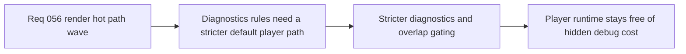

## item_207_define_a_stricter_default_player_path_for_runtime_diagnostics_and_overlap_work - Define a stricter default player path for runtime diagnostics and overlap work
> From version: 0.3.2
> Status: Draft
> Understanding: 95%
> Confidence: 94%
> Progress: 0%
> Complexity: Medium
> Theme: Performance
> Reminder: Update status/understanding/confidence/progress and linked task references when you edit this doc.

# Problem
- The repo already distinguishes player and diagnostics render modes, but the next optimization wave needs a stricter enforcement pass on what work is allowed on the default player path.
- Diagnostics-only calculations and overlays are acceptable when explicitly requested, but they should not linger as hidden continuous cost in normal play.
- This slice is needed to keep future performance work from regressing back toward “debug by default” runtime behavior.

# Scope
- In: tightening the rules around diagnostics gating, especially for debug overlays, overlap computation, inspection-heavy work, and other non-player-facing runtime helpers.
- In: defining what stays allowed while diagnostics are open versus what must remain off the default path entirely.
- Out: broader world/entity render redesign, shell/menu documentation, or removing diagnostics features outright.

# Acceptance criteria
- AC1: The slice defines a stricter rule for what diagnostics, inspection, and overlap work may execute on the default player path.
- AC2: The slice defines which debug-only overlays and calculations are allowed only when diagnostics are explicitly enabled.
- AC3: The slice stays aligned with current shell/runtime ownership and does not remove diagnostics capabilities needed for development.
- AC4: The slice makes regression risk visible through clear gating expectations and validation notes.
- AC5: The slice stays scoped to diagnostics/default-path policy rather than absorbing core render optimizations.

# AC Traceability
- AC1 -> Scope: default-player-path rules are explicit. Proof target: gating conditions, diagnostics posture docs, changed selectors/guards.
- AC2 -> Scope: debug-only work is named and bounded. Proof target: overlap diagnostics, labels, inspection and related render conditions.
- AC3 -> Scope: diagnostics remain available. Proof target: existing shell/runtime architecture refs and unchanged capability set.
- AC4 -> Scope: regression risk is surfaced. Proof target: validation checklist and profiling notes.
- AC5 -> Scope: the slice remains policy-focused. Proof target: backlog boundaries and changed files.

# Decision framing
- Product framing: Optional
- Product signals: experience scope
- Product follow-up: None.
- Architecture framing: Covered
- Architecture signals: runtime and boundaries, performance and scalability
- Architecture follow-up: Reuse existing ADRs unless implementation reveals a new irreversible seam.

# Links
- Product brief(s): `prod_001_minimal_overlay_and_feedback_for_early_runtime`
- Architecture decision(s): `adr_025_keep_shell_chrome_event_driven_and_sample_diagnostics_off_the_runtime_hot_path`, `adr_028_budget_player_runtime_and_debug_visuals_as_separate_render_modes`
- Request: `req_056_define_a_runtime_render_hot_path_optimization_wave_for_world_and_entity_drawing`
- Primary task(s): (none yet)

# References
- `src/app/components/ActiveRuntimeShellContent.tsx`
- `src/game/debug/ShellDiagnosticsPanel.tsx`
- `src/game/entities/hooks/useEntityWorld.ts`
- `src/game/entities/model/entityOccupancy.ts`

# Priority
- Impact: Medium
- Urgency: Medium

# Notes
- Derived from request `req_056_define_a_runtime_render_hot_path_optimization_wave_for_world_and_entity_drawing`.
- Source file: `logics/request/req_056_define_a_runtime_render_hot_path_optimization_wave_for_world_and_entity_drawing.md`.
