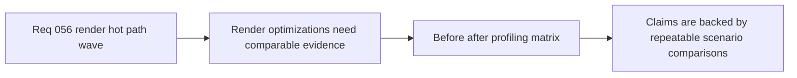

## item_208_define_a_before_after_runtime_profiling_matrix_for_render_hot_path_changes - Define a before/after runtime profiling matrix for render hot-path changes
> From version: 0.3.2
> Status: Draft
> Understanding: 97%
> Confidence: 95%
> Progress: 0%
> Complexity: Medium
> Theme: Quality
> Reminder: Update status/understanding/confidence/progress and linked task references when you edit this doc.

# Problem
- Render optimizations are easy to overclaim if the repo only reports one scenario or one headline FPS number.
- The current long-session harness is already good enough to compare scenarios, but the next wave needs a clearer validation matrix so each optimization slice proves value without hiding regressions elsewhere.
- This slice is needed to make the render optimization wave evidence-driven instead of anecdotal.

# Scope
- In: defining the before/after profiling matrix, scenarios, metrics, and evidence posture used to validate world/entity/render-path changes.
- In: defining how `eastbound-drift`, `traversal-baseline`, and `square-loop` should be read together rather than as isolated benchmark wins.
- Out: building a generic benchmarking platform, adding external observability services, or turning every run into a hard CI gate immediately.

# Acceptance criteria
- AC1: The slice defines a before/after validation matrix for render hot-path changes using the existing scripted profiling harness.
- AC2: The slice defines which scenarios, metrics, and artifact outputs must be compared for this wave.
- AC3: The slice defines how to read player-runtime FPS, frame-time pressure, and memory posture together without overclaiming one metric.
- AC4: The slice stays lightweight and repo-native rather than introducing a heavyweight benchmark stack.
- AC5: The slice keeps hard failure budgets optional unless a stable baseline justifies them later.

# AC Traceability
- AC1 -> Scope: the matrix is explicit. Proof target: task validation checklist, profiling notes, linked request/task output.
- AC2 -> Scope: scenarios and metrics are named. Proof target: runner invocation docs and artifact expectations.
- AC3 -> Scope: interpretation rules are clarified. Proof target: comparison notes for FPS, frame pacing, and memory.
- AC4 -> Scope: tooling stays repo-native. Proof target: existing profiling harness reuse.
- AC5 -> Scope: hard gating remains optional. Proof target: validation posture notes.

# Decision framing
- Product framing: Optional
- Product signals: experience scope
- Product follow-up: None.
- Architecture framing: Optional
- Architecture signals: performance and scalability
- Architecture follow-up: No new ADR required unless validation becomes a durable release gate.

# Links
- Product brief(s): `prod_001_minimal_overlay_and_feedback_for_early_runtime`
- Architecture decision(s): `adr_021_define_runtime_performance_budgets_and_profiling_at_the_shell_to_runtime_boundary`
- Request: `req_056_define_a_runtime_render_hot_path_optimization_wave_for_world_and_entity_drawing`
- Primary task(s): (none yet)

# References
- `scripts/testing/runLongSessionProfile.mjs`
- `output/playwright/long-session/eastbound-drift-2026-03-23T01-40-06-251Z.json`
- `output/playwright/long-session/traversal-baseline-2026-03-23T01-47-40-693Z.json`
- `output/playwright/long-session/square-loop-2026-03-23T01-49-48-216Z.json`

# Priority
- Impact: Medium
- Urgency: Medium

# Notes
- Derived from request `req_056_define_a_runtime_render_hot_path_optimization_wave_for_world_and_entity_drawing`.
- Source file: `logics/request/req_056_define_a_runtime_render_hot_path_optimization_wave_for_world_and_entity_drawing.md`.
