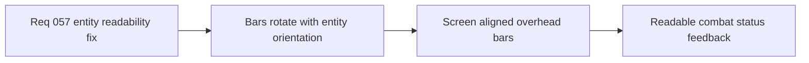

## item_209_define_a_screen_aligned_overhead_progress_bar_posture_for_combat_entities - Define a screen-aligned overhead progress-bar posture for combat entities
> From version: 0.4.0
> Status: Done
> Understanding: 100%
> Confidence: 98%
> Progress: 100%
> Complexity: Medium
> Theme: UI
> Reminder: Update status/understanding/confidence/progress and linked task references when you edit this doc.

# Problem
- Combat health and charge bars currently rotate with entity orientation, which makes overhead feedback harder to read during pivots and direction changes.
- This regression makes progress bars behave like body-attached geometry instead of player-facing status chrome.
- The issue was introduced by the `0.4.0` local-space combat render posture and needs a targeted correction that does not undo the broader render optimization wave.

# Scope
- In: defining how combat progress bars stay anchored above entities while remaining screen-aligned.
- In: defining the separation between rotating combat geometry and non-rotating overhead status bars.
- Out: redesigning all combat visuals, changing bar semantics, or reintroducing nameplates and level labels above entities.

# Acceptance criteria
- AC1: The slice defines overhead health and charge bars as screen-aligned readability elements rather than rotating body geometry.
- AC2: The slice preserves bar anchoring above player and hostile combatants while preventing rotation with entity orientation.
- AC3: The slice preserves rotating body-facing visuals such as orientation and attack-cone presentation where needed.
- AC4: The slice stays targeted to the overhead-bar contract and does not widen into general combat-UI redesign.
- AC5: The slice preserves the intent of the `0.4.0` local-space entity-render optimization posture.

# AC Traceability
- AC1 -> Scope: overhead bars are screen-aligned. Proof target: `src/game/entities/render/EntityScene.tsx`, runtime review.
- AC2 -> Scope: bars remain spatially attached above combatants without inheriting body rotation. Proof target: combat entity render structure and runtime verification.
- AC3 -> Scope: orientation-driven combat visuals still rotate appropriately. Proof target: attack/orientation visual behavior in runtime.
- AC4 -> Scope: only the overhead status contract changes. Proof target: unchanged broader combat presentation behavior and repo scope.
- AC5 -> Scope: local-space entity rendering remains intact apart from the targeted split needed for bars. Proof target: render structure in `EntityScene.tsx`.

# Decision framing
- Product framing: Required
- Product signals: readability, experience scope
- Product follow-up: None.
- Architecture framing: Consider
- Architecture signals: runtime and boundaries, performance and scalability
- Architecture follow-up: No new ADR expected unless the entity render layering changes more broadly than planned.

# Links
- Product brief(s): `prod_001_minimal_overlay_and_feedback_for_early_runtime`, `prod_003_high_density_top_down_survival_action_direction`
- Architecture decision(s): `adr_028_budget_player_runtime_and_debug_visuals_as_separate_render_modes`, `adr_038_split_entity_player_rendering_into_stable_geometry_and_transient_combat_overlays`
- Request: `req_057_define_a_screen_aligned_progress_bar_posture_for_runtime_entities`
- Primary task(s): `task_049_orchestrate_screen_aligned_entity_feedback_and_scene_rotation_control_removal`

# References
- `src/game/entities/render/EntityScene.tsx`

# Priority
- Impact: Medium
- Urgency: High

# Notes
- Derived from request `req_057_define_a_screen_aligned_progress_bar_posture_for_runtime_entities`.
- Source file: `logics/request/req_057_define_a_screen_aligned_progress_bar_posture_for_runtime_entities.md`.
- Implemented in `task_049_orchestrate_screen_aligned_entity_feedback_and_scene_rotation_control_removal` by separating non-rotating combat bars from the rotating combat-entity body container in `src/game/entities/render/EntityScene.tsx`.
