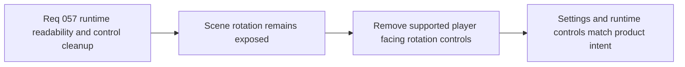

## item_210_remove_scene_rotation_controls_from_supported_player_input_and_settings - Remove scene-rotation controls from supported player input and settings
> From version: 0.4.0
> Status: Done
> Understanding: 100%
> Confidence: 98%
> Progress: 100%
> Complexity: Medium
> Theme: UX
> Reminder: Update status/understanding/confidence/progress and linked task references when you edit this doc.

# Problem
- Scene rotation is still exposed through editable desktop-control bindings and runtime camera input, even though the intended player-facing control posture no longer wants to support that interaction.
- Keeping unsupported scene-rotation controls visible in `Settings` creates misleading affordances and unnecessary configuration surface.
- This leaves product intent, runtime behavior, and settings presentation out of sync.

# Scope
- In: removing scene-rotation bindings from supported player-facing desktop controls.
- In: removing scene-rotation affordances from `Settings` and aligning tests/storage defaults with the new control posture.
- Out: broader camera-system redesign, diagnostics-only camera tooling, or reconsidering all camera modes.

# Acceptance criteria
- AC1: The slice defines scene rotation as unsupported in the player-facing control surface.
- AC2: The slice removes scene-rotation bindings from the editable desktop-control settings posture.
- AC3: The slice disables the corresponding player-facing runtime input path so removed settings affordances do not leave a hidden supported behavior behind.
- AC4: The slice updates related control-binding validation, defaults, and tests to reflect the reduced control set.
- AC5: The slice stays limited to supported player controls and does not widen into a broader camera redesign.

# AC Traceability
- AC1 -> Scope: scene rotation is no longer a supported player control. Proof target: control contract and settings posture.
- AC2 -> Scope: `Settings` no longer shows rotate-left / rotate-right slots. Proof target: `src/app/components/DesktopControlSettingsSection.tsx` and tests.
- AC3 -> Scope: player-facing runtime input no longer rotates the scene through the removed controls. Proof target: camera/input hooks and tests.
- AC4 -> Scope: defaults, validation, and storage stay coherent after the control-set reduction. Proof target: binding model, storage helpers, and related tests.
- AC5 -> Scope: camera architecture remains otherwise unchanged. Proof target: limited file scope and request boundaries.

# Decision framing
- Product framing: Required
- Product signals: usability, navigation and discoverability
- Product follow-up: None.
- Architecture framing: Consider
- Architecture signals: runtime and boundaries
- Architecture follow-up: No new ADR expected unless a later request revisits supported camera behavior.

# Links
- Product brief(s): `prod_001_minimal_overlay_and_feedback_for_early_runtime`
- Architecture decision(s): `adr_016_define_shell_scene_state_and_meta_surface_ownership`, `adr_025_keep_shell_chrome_event_driven_and_sample_diagnostics_off_the_runtime_hot_path`
- Request: `req_057_define_a_screen_aligned_progress_bar_posture_for_runtime_entities`
- Primary task(s): `task_049_orchestrate_screen_aligned_entity_feedback_and_scene_rotation_control_removal`

# References
- `src/app/components/DesktopControlSettingsSection.tsx`
- `src/game/camera/hooks/useCameraController.ts`
- `src/game/input/model/singleEntityControlContract.ts`
- `src/app/model/desktopControlBindings.ts`

# Priority
- Impact: Medium
- Urgency: High

# Notes
- Derived from request `req_057_define_a_screen_aligned_progress_bar_posture_for_runtime_entities`.
- Source file: `logics/request/req_057_define_a_screen_aligned_progress_bar_posture_for_runtime_entities.md`.
- Implemented in `task_049_orchestrate_screen_aligned_entity_feedback_and_scene_rotation_control_removal` by removing rotate-left / rotate-right from the desktop control contract and settings UI, disabling keyboard/touch rotation input paths in `src/game/camera/hooks/useCameraController.ts`, and normalizing persisted camera rotation on session load.
