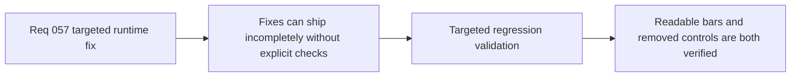

## item_211_define_targeted_regression_validation_for_entity_bar_alignment_and_rotation_control_removal - Define targeted regression validation for entity-bar alignment and rotation-control removal
> From version: 0.4.0
> Status: Done
> Understanding: 99%
> Confidence: 98%
> Progress: 100%
> Complexity: Low
> Theme: Quality
> Reminder: Update status/understanding/confidence/progress and linked task references when you edit this doc.

# Problem
- The bar-rotation regression is visual, and the scene-rotation removal changes control surfaces and tests, so both issues can be easy to “fix” incompletely if validation stays implicit.
- This wave needs targeted evidence that overhead bars remain readable during turning and that removed scene-rotation controls are gone from both settings and runtime player input.
- Without a dedicated validation slice, the repo risks shipping partial fixes or leaving stale tests behind.

# Scope
- In: defining targeted validation for screen-aligned bars, settings-control removal, and runtime input regression checks.
- In: defining the minimal automated and manual evidence needed for this narrow wave.
- Out: turning this slice into a broader performance campaign or a new end-to-end benchmarking stack.

# Acceptance criteria
- AC1: The slice defines targeted validation for overhead bars staying horizontally readable while combat entities rotate.
- AC2: The slice defines validation that scene-rotation bindings are absent from `Settings` and related player-facing control surfaces.
- AC3: The slice defines validation that removed scene-rotation controls no longer rotate the runtime camera through supported player input.
- AC4: The slice keeps validation lightweight and repo-native through existing tests plus targeted runtime verification.

# AC Traceability
- AC1 -> Scope: bar readability under turning is explicitly checked. Proof target: runtime review and relevant render tests where practical.
- AC2 -> Scope: settings/control-surface removal is covered. Proof target: component tests and binding-model tests.
- AC3 -> Scope: runtime input path no longer rotates through removed player controls. Proof target: camera/input tests.
- AC4 -> Scope: validation stays lightweight. Proof target: repository test commands and manual runtime notes.

# Decision framing
- Product framing: Optional
- Product signals: readability
- Product follow-up: None.
- Architecture framing: Optional
- Architecture signals: runtime and boundaries
- Architecture follow-up: None.

# Links
- Product brief(s): `prod_001_minimal_overlay_and_feedback_for_early_runtime`
- Architecture decision(s): `adr_028_budget_player_runtime_and_debug_visuals_as_separate_render_modes`, `adr_038_split_entity_player_rendering_into_stable_geometry_and_transient_combat_overlays`
- Request: `req_057_define_a_screen_aligned_progress_bar_posture_for_runtime_entities`
- Primary task(s): `task_049_orchestrate_screen_aligned_entity_feedback_and_scene_rotation_control_removal`

# References
- `src/app/components/DesktopControlSettingsSection.test.tsx`
- `src/game/camera/hooks/useCameraController.test.tsx`
- `src/game/entities/render/EntityScene.tsx`

# Priority
- Impact: Medium
- Urgency: Medium

# Notes
- Derived from request `req_057_define_a_screen_aligned_progress_bar_posture_for_runtime_entities`.
- Source file: `logics/request/req_057_define_a_screen_aligned_progress_bar_posture_for_runtime_entities.md`.
- Implemented in `task_049_orchestrate_screen_aligned_entity_feedback_and_scene_rotation_control_removal` through targeted unit coverage for settings, binding storage, runtime-session normalization, and camera input, plus browser smoke and manual preview verification of horizontal overhead bars and the removed settings controls.
