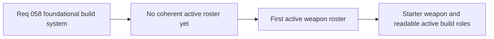

## item_212_define_a_first_foundational_active_weapon_roster_and_adapt_the_current_attack_into_the_starter_weapon - Define a first foundational active weapon roster and adapt the current attack into the starter weapon
> From version: 0.4.0
> Status: Draft
> Understanding: 98%
> Confidence: 97%
> Progress: 0%
> Complexity: High
> Theme: Gameplay
> Reminder: Update status/understanding/confidence/progress and linked task references when you edit this doc.

# Problem
- Emberwake currently has only one real attack in the runtime, which is not yet part of a coherent weapon roster.
- Without a deliberate first active roster, the build system cannot support readable level-up choices, meaningful build diversity, or future fusion payoffs.
- The current frontal automatic attack also needs a clear product role as the first starter weapon rather than remaining a generic placeholder combat action.

# Scope
- In: defining the first active-weapon roster posture, active role coverage, and adaptation of the current frontal attack into the first Emberwake starter weapon.
- In: defining how the first active roster copies genre-proven role grammar while remaining Emberwake-specific in naming and fantasy.
- Out: full exact numeric tuning for every weapon, exhaustive later-wave content, or final fusion recipes for all actives.

# Acceptance criteria
- AC1: The slice defines a first-wave active roster posture at a small, implementation-friendly scale.
- AC2: The slice adapts the current frontal automatic attack into the first Emberwake starter weapon with a clear `Whip-like` role.
- AC3: The slice defines active roles that cover foundational survivor-like combat patterns rather than one-off unrelated attacks.
- AC4: The slice requires Emberwake-specific naming and fantasy rather than direct carryover names from source games.
- AC5: The slice keeps the active roster compatible with later passive pairings and curated fusion payoff.

# AC Traceability
- AC1 -> Scope: first-wave roster size and role posture are explicit. Proof target: active-weapon content plan and linked request/task output.
- AC2 -> Scope: the current attack becomes the formal starter weapon. Proof target: combat-content implementation and starter-loadout logic.
- AC3 -> Scope: foundational active role coverage is explicit. Proof target: content definitions and design notes.
- AC4 -> Scope: naming and surface identity remain Emberwake-specific. Proof target: weapon names, labels, and presentation assets/copy.
- AC5 -> Scope: active roster stays fusion-ready. Proof target: links to passive and fusion slices plus content mapping notes.

# Decision framing
- Product framing: Required
- Product signals: experience scope, readability, engagement loop
- Product follow-up: None.
- Architecture framing: Consider
- Architecture signals: runtime and boundaries
- Architecture follow-up: Keep active-content structure aligned with slot and fusion ADRs.

# Links
- Product brief(s): `prod_003_high_density_top_down_survival_action_direction`, `prod_005_visual_identity_dark_fantasy_with_synthetic_energy_accents`, `prod_006_foundational_survivor_weapon_roster_for_emberwake`
- Architecture decision(s): `adr_039_structure_the_first_survivor_build_loop_around_separate_active_and_passive_slots`, `adr_040_use_curated_active_passive_fusions_as_the_foundational_build_payoff_layer`
- Request: `req_058_define_a_foundational_survivor_build_system_for_weapons_passives_fusions_and_run_progression`
- Primary task(s): `task_050_orchestrate_the_foundational_survivor_build_system_wave`

# References
- `logics/product/prod_006_foundational_survivor_weapon_roster_for_emberwake.md`

# Priority
- Impact: High
- Urgency: High

# Notes
- Derived from request `req_058_define_a_foundational_survivor_build_system_for_weapons_passives_fusions_and_run_progression`.
- Source file: `logics/request/req_058_define_a_foundational_survivor_build_system_for_weapons_passives_fusions_and_run_progression.md`.
