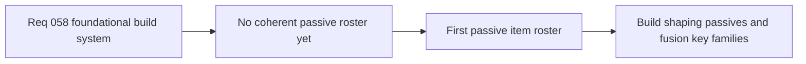

## item_213_define_a_first_foundational_passive_item_roster_with_clear_fusion_key_families - Define a first foundational passive item roster with clear fusion-key families
> From version: 0.4.0
> Status: Draft
> Understanding: 98%
> Confidence: 97%
> Progress: 0%
> Complexity: High
> Theme: Gameplay
> Reminder: Update status/understanding/confidence/progress and linked task references when you edit this doc.

# Problem
- Without a clear passive roster, level-up choices will skew too hard toward active weapons and builds will stay shallow.
- Emberwake also needs passive families that can later serve as readable fusion keys; otherwise future evolutions will feel arbitrary.
- The project therefore needs a first passive roster that supports both mid-run build identity and later curated fusion logic.

# Scope
- In: defining the first passive roster posture, passive role families, and fusion-key readiness requirements.
- In: defining Emberwake-specific naming and fantasy for passives rather than direct source-name reuse.
- Out: final numeric tuning for every passive, exhaustive later content, or complete fusion recipe tables.

# Acceptance criteria
- AC1: The slice defines a first-wave passive roster posture at a small, implementation-friendly scale.
- AC2: The slice defines passive families that shape builds rather than behaving like vague filler stats.
- AC3: The slice includes clear fusion-key candidate families for later curated active + passive payoffs.
- AC4: The slice uses Emberwake-specific naming and fantasy rather than direct carryover names.
- AC5: The slice keeps the passive roster legible enough that players can understand why certain passives matter to certain weapons.

# AC Traceability
- AC1 -> Scope: first-wave passive roster size and structure are explicit. Proof target: passive content plan and task output.
- AC2 -> Scope: passives clearly shape builds. Proof target: passive role definitions and in-run level-up logic.
- AC3 -> Scope: fusion-key families are explicit. Proof target: links to fusion slice and pair-mapping notes.
- AC4 -> Scope: passive naming remains Emberwake-specific. Proof target: passive labels and content definitions.
- AC5 -> Scope: passive-value readability is preserved. Proof target: content descriptions and player-facing presentation notes.

# Decision framing
- Product framing: Required
- Product signals: readability, engagement loop, experience scope
- Product follow-up: None.
- Architecture framing: Consider
- Architecture signals: runtime and boundaries
- Architecture follow-up: Keep passive-content structure aligned with slot and fusion ADRs.

# Links
- Product brief(s): `prod_005_visual_identity_dark_fantasy_with_synthetic_energy_accents`, `prod_007_foundational_passive_item_direction_for_emberwake`
- Architecture decision(s): `adr_039_structure_the_first_survivor_build_loop_around_separate_active_and_passive_slots`, `adr_040_use_curated_active_passive_fusions_as_the_foundational_build_payoff_layer`
- Request: `req_058_define_a_foundational_survivor_build_system_for_weapons_passives_fusions_and_run_progression`
- Primary task(s): `task_050_orchestrate_the_foundational_survivor_build_system_wave`

# References
- `logics/product/prod_007_foundational_passive_item_direction_for_emberwake.md`

# Priority
- Impact: High
- Urgency: High

# Notes
- Derived from request `req_058_define_a_foundational_survivor_build_system_for_weapons_passives_fusions_and_run_progression`.
- Source file: `logics/request/req_058_define_a_foundational_survivor_build_system_for_weapons_passives_fusions_and_run_progression.md`.
