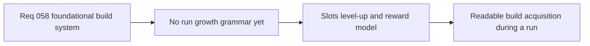

## item_214_define_a_slot_limited_level_up_and_run_reward_model_for_build_growth - Define a slot-limited level-up and run reward model for build growth
> From version: 0.4.0
> Status: Draft
> Understanding: 98%
> Confidence: 97%
> Progress: 0%
> Complexity: High
> Theme: Gameplay
> Reminder: Update status/understanding/confidence/progress and linked task references when you edit this doc.

# Problem
- Active and passive rosters are not enough on their own; Emberwake still needs a clear run-level acquisition grammar.
- Without explicit slot counts, level-up choice posture, and reward logic, the build system risks becoming arbitrary and hard to teach.
- The first survivor loop needs a disciplined default progression model before broader tuning or content expansion begins.

# Scope
- In: defining active/passive slot counts, level-up choice posture, pool behavior, and chest-like reward role in the first build loop.
- In: defining how run growth should move from build establishment into build shaping and payoff.
- Out: exact XP math, full drop tables, meta-progression, or a full spec for every future reroll/banish system.

# Acceptance criteria
- AC1: The slice defines separate active and passive slot posture for the first build loop.
- AC2: The slice defines a first default level-up choice posture and what kinds of picks may appear.
- AC3: The slice defines how early-run choices differ from mid-run shaping and payoff choices.
- AC4: The slice defines the role of chest-like or equivalent secondary rewards in the first build system.
- AC5: The slice remains conservative and genre-proven rather than reinventing the acquisition grammar before the baseline is proven.

# AC Traceability
- AC1 -> Scope: slot posture is explicit. Proof target: build-state model and progression docs.
- AC2 -> Scope: level-up choice grammar is explicit. Proof target: run progression rules and level-up implementation notes.
- AC3 -> Scope: early/mid-run pool posture is defined. Proof target: reward-selection logic and linked tests.
- AC4 -> Scope: chest-like reward role is explicit. Proof target: reward logic and fusion-trigger notes.
- AC5 -> Scope: acquisition loop stays genre-proven. Proof target: request/task delivery notes and product references.

# Decision framing
- Product framing: Required
- Product signals: engagement loop, readability, progression
- Product follow-up: None.
- Architecture framing: Required
- Architecture signals: runtime and boundaries
- Architecture follow-up: Keep build-state ownership and slot semantics aligned with the new slot ADR.

# Links
- Product brief(s): `prod_003_high_density_top_down_survival_action_direction`, `prod_009_level_up_slots_and_run_progression_model_for_emberwake`
- Architecture decision(s): `adr_039_structure_the_first_survivor_build_loop_around_separate_active_and_passive_slots`
- Request: `req_058_define_a_foundational_survivor_build_system_for_weapons_passives_fusions_and_run_progression`
- Primary task(s): `task_050_orchestrate_the_foundational_survivor_build_system_wave`

# References
- `logics/product/prod_009_level_up_slots_and_run_progression_model_for_emberwake.md`

# Priority
- Impact: High
- Urgency: High

# Notes
- Derived from request `req_058_define_a_foundational_survivor_build_system_for_weapons_passives_fusions_and_run_progression`.
- Source file: `logics/request/req_058_define_a_foundational_survivor_build_system_for_weapons_passives_fusions_and_run_progression.md`.
