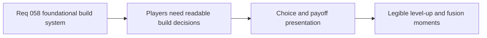

## item_216_define_player_facing_build_choice_and_fusion_payoff_presentation_for_the_first_survivor_loop - Define player-facing build choice and fusion payoff presentation for the first survivor loop
> From version: 0.4.0
> Status: Done
> Understanding: 100%
> Confidence: 98%
> Progress: 100%
> Complexity: Medium
> Theme: UX
> Reminder: Update status/understanding/confidence/progress and linked task references when you edit this doc.

# Problem
- A build system can be mechanically sound but still fail if the player cannot read what choices mean, what slots are full, or why a fusion payoff happened.
- Emberwake’s first survivor loop therefore needs clear player-facing presentation for level-up choices, owned build state, and fusion payoff moments.
- Without a dedicated presentation slice, the gameplay system may land with weak usability and poor build comprehension.

# Scope
- In: defining player-facing presentation for level-up choices, active/passive slot state, and fusion payoff readability.
- In: defining how naming, copy, and UI feedback support the new build loop.
- Out: final polished art direction for every card or panel, or broad menu redesign outside the build flow.

# Acceptance criteria
- AC1: The slice defines how level-up choices should be presented so active, passive, and upgrade picks are readable at a glance.
- AC2: The slice defines how the player can understand current active/passive slot state during a run.
- AC3: The slice defines how fusion payoff moments should be communicated clearly and satisfyingly.
- AC4: The slice keeps presentation aligned with Emberwake naming and fantasy rather than generic placeholder labels.
- AC5: The slice stays focused on build-loop readability rather than widening into a full shell redesign.

# AC Traceability
- AC1 -> Scope: level-up presentation is explicit. Proof target: UI/presentation implementation and tests.
- AC2 -> Scope: owned build state is readable. Proof target: HUD or build-state presentation updates.
- AC3 -> Scope: fusion payoff messaging is explicit. Proof target: reward/upgrade presentation and runtime verification.
- AC4 -> Scope: copy and labels remain Emberwake-specific. Proof target: UI copy and content labels.
- AC5 -> Scope: build-loop readability stays the focus. Proof target: limited UI scope and linked request boundaries.

# Decision framing
- Product framing: Required
- Product signals: readability, usability, engagement loop
- Product follow-up: None.
- Architecture framing: Optional
- Architecture signals: runtime and boundaries
- Architecture follow-up: None unless build presentation forces a new shell/runtime ownership boundary.

# Links
- Product brief(s): `prod_001_minimal_overlay_and_feedback_for_early_runtime`, `prod_005_visual_identity_dark_fantasy_with_synthetic_energy_accents`, `prod_008_active_passive_fusion_direction_for_emberwake`, `prod_009_level_up_slots_and_run_progression_model_for_emberwake`
- Architecture decision(s): `adr_025_keep_shell_chrome_event_driven_and_sample_diagnostics_off_the_runtime_hot_path`
- Request: `req_058_define_a_foundational_survivor_build_system_for_weapons_passives_fusions_and_run_progression`
- Primary task(s): `task_050_orchestrate_the_foundational_survivor_build_system_wave`

# References
- `logics/product/prod_008_active_passive_fusion_direction_for_emberwake.md`
- `logics/product/prod_009_level_up_slots_and_run_progression_model_for_emberwake.md`

# Priority
- Impact: Medium
- Urgency: High

# Notes
- Derived from request `req_058_define_a_foundational_survivor_build_system_for_weapons_passives_fusions_and_run_progression`.
- Source file: `logics/request/req_058_define_a_foundational_survivor_build_system_for_weapons_passives_fusions_and_run_progression.md`.
