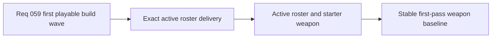

## item_218_define_the_first_exact_techno_shinobi_active_roster_and_starter_weapon_delivery - Define the first exact techno-shinobi active roster and starter weapon delivery
> From version: 0.4.0
> Status: Done
> Understanding: 100%
> Confidence: 98%
> Progress: 100%
> Complexity: Medium
> Theme: Gameplay
> Reminder: Update status/understanding/confidence/progress and linked task references when you edit this doc.

# Problem
- `Emberwake` now has the product direction for a first exact active roster, but the project still needs one implementation-facing slice that turns those named roles into a real first-pass runtime set.
- The current frontal attack must stop being a one-off mechanic and become the formal techno-shinobi starter weapon `Ash Lash`.
- Without a dedicated active-roster slice, the build wave risks shipping progression scaffolding without a stable content baseline.

# Scope
- In: defining and delivering the first exact active roster posture for `Ash Lash`, `Guided Senbon`, `Shade Kunai`, `Cinder Arc`, `Orbit Sutra`, and `Null Canister`.
- In: adapting the current frontal automatic attack into the formal `Ash Lash` starter role.
- In: locking active-weapon naming and short role identity for the first playable wave.
- Out: full long-term weapon roster expansion or final balance certification.

# Acceptance criteria
- AC1: The slice defines the first exact active roster for the first playable wave with the six named techno-shinobi weapons.
- AC2: The slice defines `Ash Lash` as the formal starter weapon derived from the existing frontal attack.
- AC3: The slice locks short role identity for each first-wave active weapon tightly enough to guide implementation and UI language.
- AC4: The slice keeps the first active roster bounded and does not widen into broader content expansion.

# AC Traceability
- AC1 -> Scope: six exact active weapons are fixed. Proof target: linked content definitions and roster references.
- AC2 -> Scope: starter-weapon continuity is explicit. Proof target: starter-loadout and weapon-definition references.
- AC3 -> Scope: role identity is locked for implementation. Proof target: concise weapon-role descriptions.
- AC4 -> Scope: first wave stays bounded. Proof target: explicit exclusion of broader roster expansion.

# Decision framing
- Product framing: Required
- Product signals: readability, role coverage, onboarding
- Product follow-up: None.
- Architecture framing: Optional
- Architecture signals: runtime and boundaries
- Architecture follow-up: None.

# Links
- Product brief(s): `prod_006_foundational_survivor_weapon_roster_for_emberwake`, `prod_010_first_playable_techno_shinobi_build_content_and_progression_defaults`
- Architecture decision(s): `adr_041_lock_the_first_playable_survivor_content_wave_to_one_character_and_a_small_curated_techno_shinobi_roster`
- Request: `req_059_define_a_first_playable_techno_shinobi_build_content_wave`
- Primary task(s): `task_051_orchestrate_the_first_playable_techno_shinobi_build_content_wave`

# References
- `logics/product/prod_006_foundational_survivor_weapon_roster_for_emberwake.md`
- `logics/product/prod_010_first_playable_techno_shinobi_build_content_and_progression_defaults.md`
- `logics/request/req_059_define_a_first_playable_techno_shinobi_build_content_wave.md`

# Priority
- Impact: High
- Urgency: High

# Notes
- Derived from request `req_059_define_a_first_playable_techno_shinobi_build_content_wave`.
- Source file: `logics/request/req_059_define_a_first_playable_techno_shinobi_build_content_wave.md`.
