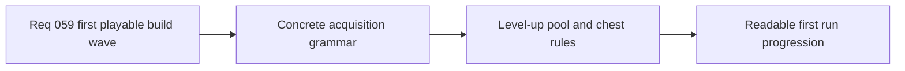

## item_220_define_first_pass_level_up_pool_and_chest_rules_for_the_techno_shinobi_build_loop - Define first-pass level-up pool and chest rules for the techno-shinobi build loop
> From version: 0.4.0
> Status: Draft
> Understanding: 97%
> Confidence: 96%
> Progress: 0%
> Complexity: High
> Theme: Gameplay
> Reminder: Update status/understanding/confidence/progress and linked task references when you edit this doc.

# Problem
- The first exact content package still needs concrete acquisition grammar.
- The player needs a first-pass rule set for how new active weapons, passive items, upgrades, and chest rewards appear during a run.
- Without a level-up pool and chest slice, the first techno-shinobi roster cannot become a readable playable loop.

# Scope
- In: defining the first-pass level-up offer model with `3` choices and separate active/passive slot logic.
- In: defining early, mid-run, and late-run pool bias rules for the bounded first roster.
- In: defining first-pass chest rules as owned-upgrade and fusion-payoff moments.
- Out: reroll systems, banish systems, rarity systems, or meta progression.

# Acceptance criteria
- AC1: The slice defines first-pass level-up choice rules for new actives, new passives, and upgrades across the bounded roster.
- AC2: The slice defines early, mid-run, and late-run pool-bias posture tightly enough to reduce dead rolls.
- AC3: The slice defines first-pass chest posture as an owned-upgrade and fusion-payoff system rather than as a parallel item-acquisition grammar.
- AC4: The slice stays bounded to the first playable wave and does not widen into advanced reward modifiers.

# AC Traceability
- AC1 -> Scope: build acquisition rules are fixed. Proof target: pool-rule references and level-up posture.
- AC2 -> Scope: pool quality is addressed. Proof target: early/mid/late bias notes.
- AC3 -> Scope: chest identity is fixed. Proof target: chest-rule references and payoff posture.
- AC4 -> Scope: slice remains focused. Proof target: explicit exclusions for advanced reward systems.

# Decision framing
- Product framing: Required
- Product signals: progression, readability, engagement loop
- Product follow-up: None.
- Architecture framing: Required
- Architecture signals: runtime and boundaries
- Architecture follow-up: keep pool and chest logic consistent with active/passive slot ADRs.

# Links
- Product brief(s): `prod_009_level_up_slots_and_run_progression_model_for_emberwake`, `prod_010_first_playable_techno_shinobi_build_content_and_progression_defaults`
- Architecture decision(s): `adr_039_structure_the_first_survivor_build_loop_around_separate_active_and_passive_slots`, `adr_041_lock_the_first_playable_survivor_content_wave_to_one_character_and_a_small_curated_techno_shinobi_roster`
- Request: `req_059_define_a_first_playable_techno_shinobi_build_content_wave`
- Primary task(s): `task_051_orchestrate_the_first_playable_techno_shinobi_build_content_wave`

# References
- `logics/product/prod_009_level_up_slots_and_run_progression_model_for_emberwake.md`
- `logics/product/prod_010_first_playable_techno_shinobi_build_content_and_progression_defaults.md`
- `logics/request/req_059_define_a_first_playable_techno_shinobi_build_content_wave.md`

# Priority
- Impact: High
- Urgency: High

# Notes
- Derived from request `req_059_define_a_first_playable_techno_shinobi_build_content_wave`.
- Source file: `logics/request/req_059_define_a_first_playable_techno_shinobi_build_content_wave.md`.
