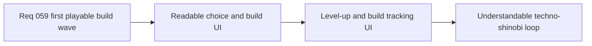

## item_222_define_player_facing_level_up_and_build_tracking_ui_for_the_first_techno_shinobi_loop - Define player-facing level-up and build tracking UI for the first techno-shinobi loop
> From version: 0.4.0
> Status: Draft
> Understanding: 97%
> Confidence: 96%
> Progress: 0%
> Complexity: Medium
> Theme: UX
> Reminder: Update status/understanding/confidence/progress and linked task references when you edit this doc.

# Problem
- The first build loop will fail product-wise if the player cannot read what they are choosing or what they already own.
- `Emberwake` needs a first-pass level-up choice surface and a build-tracking posture that fit the techno-shinobi shell language rather than generic RPG popups.
- Without this slice, the content and progression rules may exist but remain opaque in play.

# Scope
- In: defining the first-pass level-up choice UI for `3` techno-shinobi build cards.
- In: defining build tracking in the runtime feedback surface for active slots, passive slots, level markers, and restrained fusion-readiness indicators.
- In: keeping the UI clear on desktop and workable on mobile-sized viewports.
- Out: large future inventory screens, full codex views, or spoiler-heavy recipe UIs.

# Acceptance criteria
- AC1: The slice defines a first-pass level-up choice UI with clear item type, role line, and level delta presentation.
- AC2: The slice defines build tracking for owned active and passive slots plus compact level state.
- AC3: The slice defines restrained fusion-readiness indicators that stay legible without overexposing recipes.
- AC4: The slice keeps the first UI pass bounded and aligned with the techno-shinobi shell direction.

# AC Traceability
- AC1 -> Scope: choice UI is covered. Proof target: UI states and card-content references.
- AC2 -> Scope: owned-build visibility is covered. Proof target: runtime feedback references.
- AC3 -> Scope: fusion-readiness communication is covered. Proof target: indicator references and interaction posture.
- AC4 -> Scope: UI stays bounded and theme-aligned. Proof target: explicit exclusions and visual-language notes.

# Decision framing
- Product framing: Required
- Product signals: readability, engagement loop, experience cohesion
- Product follow-up: None.
- Architecture framing: Optional
- Architecture signals: runtime and boundaries
- Architecture follow-up: None.

# Links
- Product brief(s): `prod_001_minimal_overlay_and_feedback_for_early_runtime`, `prod_005_visual_identity_dark_fantasy_with_synthetic_energy_accents`, `prod_010_first_playable_techno_shinobi_build_content_and_progression_defaults`
- Architecture decision(s): `adr_041_lock_the_first_playable_survivor_content_wave_to_one_character_and_a_small_curated_techno_shinobi_roster`
- Request: `req_059_define_a_first_playable_techno_shinobi_build_content_wave`
- Primary task(s): `task_051_orchestrate_the_first_playable_techno_shinobi_build_content_wave`

# References
- `logics/product/prod_001_minimal_overlay_and_feedback_for_early_runtime.md`
- `logics/product/prod_005_visual_identity_dark_fantasy_with_synthetic_energy_accents.md`
- `logics/product/prod_010_first_playable_techno_shinobi_build_content_and_progression_defaults.md`
- `logics/request/req_059_define_a_first_playable_techno_shinobi_build_content_wave.md`

# Priority
- Impact: High
- Urgency: High

# Notes
- Derived from request `req_059_define_a_first_playable_techno_shinobi_build_content_wave`.
- Source file: `logics/request/req_059_define_a_first_playable_techno_shinobi_build_content_wave.md`.
