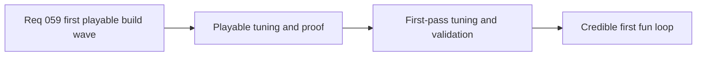

## item_223_define_first_playable_tuning_and_validation_for_the_techno_shinobi_build_wave - Define first playable tuning and validation for the techno-shinobi build wave
> From version: 0.5.0
> Status: Done
> Understanding: 100%
> Confidence: 98%
> Progress: 100%
> Complexity: Medium
> Theme: Quality
> Reminder: Update status/understanding/confidence/progress and linked task references when you edit this doc.

# Problem
- The first exact build wave now has concrete content and progression posture, but it still needs a shared first-pass tuning and validation slice.
- The project needs one bounded baseline for weapon cadence, early progression pace, chest rhythm, and first fusion timing.
- Without this slice, the first loop may technically exist but still fail to feel readable or fun.

# Scope
- In: defining the first-pass tuning baseline for the six active weapons, six passives, progression cadence, and first fusion timing.
- In: defining targeted validation for starter flow, slot pressure, useful level-up choices, at least one fusion payoff, and techno-shinobi UI readability.
- In: keeping the evidence lightweight and repo-native.
- Out: final balance, analytics-heavy balancing infrastructure, or long-form live-ops style tuning.

# Acceptance criteria
- AC1: The slice defines a first-pass tuning baseline for active roles, progression pace, chest rhythm, and expected fusion timing.
- AC2: The slice defines targeted validation for starter flow, level-up usefulness, slot pressure, and at least one readable fusion payoff.
- AC3: The slice defines manual readability validation for the techno-shinobi level-up and build-tracking surfaces.
- AC4: The slice keeps tuning and validation lightweight enough for a first playable wave.

# AC Traceability
- AC1 -> Scope: tuning baseline is fixed. Proof target: tuning notes or linked data references.
- AC2 -> Scope: core loop proof is covered. Proof target: automated and manual validation checklist.
- AC3 -> Scope: UI readability is explicitly checked. Proof target: manual validation notes and screenshots where helpful.
- AC4 -> Scope: slice remains lightweight. Proof target: bounded command list and explicit exclusions.

# Request AC Traceability
- req_059_define_a_first_playable_techno_shinobi_build_content_wave coverage: AC1, AC2, AC3, AC4, AC5, AC6, AC7, AC8. Proof: `item_223_define_first_playable_tuning_and_validation_for_the_techno_shinobi_build_wave` remains the request-closing backlog slice for `req_059_define_a_first_playable_techno_shinobi_build_content_wave` and stays linked to `task_051_orchestrate_the_first_playable_techno_shinobi_build_content_wave` for delivered implementation evidence.

# Decision framing
- Product framing: Required
- Product signals: readability, engagement loop, progression feel
- Product follow-up: None.
- Architecture framing: Optional
- Architecture signals: runtime and boundaries
- Architecture follow-up: None.

# Links
- Product brief(s): `prod_009_level_up_slots_and_run_progression_model_for_emberwake`, `prod_010_first_playable_techno_shinobi_build_content_and_progression_defaults`
- Architecture decision(s): `adr_041_lock_the_first_playable_survivor_content_wave_to_one_character_and_a_small_curated_techno_shinobi_roster`
- Request: `req_059_define_a_first_playable_techno_shinobi_build_content_wave`
- Primary task(s): `task_051_orchestrate_the_first_playable_techno_shinobi_build_content_wave`

# References
- `logics/product/prod_009_level_up_slots_and_run_progression_model_for_emberwake.md`
- `logics/product/prod_010_first_playable_techno_shinobi_build_content_and_progression_defaults.md`
- `logics/request/req_059_define_a_first_playable_techno_shinobi_build_content_wave.md`

# Priority
- Impact: High
- Urgency: High

# Notes
- Derived from request `req_059_define_a_first_playable_techno_shinobi_build_content_wave`.
- Source file: `logics/request/req_059_define_a_first_playable_techno_shinobi_build_content_wave.md`.
