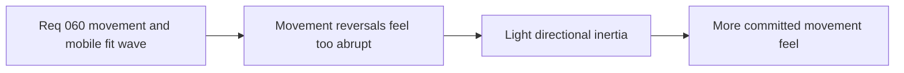

## item_224_define_a_light_directional_inertia_posture_for_player_movement_reversals - Define a light directional inertia posture for player movement reversals
> From version: 0.4.0
> Status: Done
> Understanding: 100%
> Confidence: 98%
> Progress: 100%
> Complexity: Medium
> Theme: Gameplay
> Reminder: Update status/understanding/confidence/progress and linked task references when you edit this doc.

# Problem
- Player movement direction changes are currently too abrupt, especially when snapping between opposite directions.
- This produces a nervous left-right twitch pattern that feels too frictionless for the intended combat language.
- The game needs a bounded inertia correction that keeps controls responsive while adding a small commitment cost to harsh reversals.

# Scope
- In: defining a light movement-inertia posture for player direction reversals.
- In: biasing the correction toward hard reversals rather than making all steering feel heavy.
- In: keeping the result compatible with the current deterministic movement model.
- Out: full physics-style momentum, broad movement-system rewrite, or camera-behavior redesign.

# Acceptance criteria
- AC1: The slice defines a bounded movement-inertia correction for hard direction reversals.
- AC2: The slice keeps player movement responsive and avoids a heavy-momentum feel.
- AC3: The slice keeps the correction aligned with the existing deterministic movement posture.
- AC4: The slice stays limited to reversal-feel correction and does not widen into a broad movement redesign.

# AC Traceability
- AC1 -> Scope: reversal correction exists. Proof target: movement-model changes and runtime verification.
- AC2 -> Scope: responsiveness remains intact. Proof target: tuning posture and manual feel checks.
- AC3 -> Scope: current movement architecture is respected. Proof target: limited file scope and deterministic behavior.
- AC4 -> Scope: slice stays bounded. Proof target: explicit exclusions and request alignment.

# Decision framing
- Product framing: Required
- Product signals: feel, responsiveness, control expression
- Product follow-up: None.
- Architecture framing: Consider
- Architecture signals: runtime and boundaries
- Architecture follow-up: no new ADR expected unless the implementation forces a larger movement-model shift.

# Links
- Product brief(s): `prod_003_high_density_top_down_survival_action_direction`
- Architecture decision(s): `adr_033_adopt_deterministic_movement_oriented_pseudo_physics_instead_of_a_full_physics_engine`
- Request: `req_060_define_a_smoother_movement_inertia_and_mobile_shell_fit_wave`
- Primary task(s): `task_052_orchestrate_movement_inertia_and_mobile_shell_fit_cleanup`

# References
- `logics/request/req_060_define_a_smoother_movement_inertia_and_mobile_shell_fit_wave.md`

# Priority
- Impact: High
- Urgency: High

# Notes
- Derived from request `req_060_define_a_smoother_movement_inertia_and_mobile_shell_fit_wave`.
- Source file: `logics/request/req_060_define_a_smoother_movement_inertia_and_mobile_shell_fit_wave.md`.
