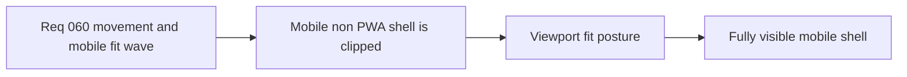

## item_225_define_a_mobile_non_pwa_viewport_fit_posture_for_full_shell_visibility - Define a mobile non-PWA viewport fit posture for full shell visibility
> From version: 0.4.0
> Status: Done
> Understanding: 100%
> Confidence: 98%
> Progress: 100%
> Complexity: Medium
> Theme: UX
> Reminder: Update status/understanding/confidence/progress and linked task references when you edit this doc.

# Problem
- On mobile browsers outside installed PWA mode, the page can be truncated or clipped near the bottom edge.
- This breaks shell usability and makes the product look unstable before the user even installs the app.
- The shell needs a first-pass viewport-fit posture that keeps the full page visible on mobile web, not only in standalone mode.

# Scope
- In: defining a safe mobile viewport-fit posture for non-PWA browser usage.
- In: ensuring bottom-edge shell content remains visible on mobile viewports.
- In: aligning the shell with mobile browser safe-area and viewport-height realities.
- Out: broad responsive-shell redesign or a PWA-install funnel redesign.

# Acceptance criteria
- AC1: The slice defines a safe mobile viewport-fit posture for non-PWA browser usage.
- AC2: The slice defines the need to keep bottom-edge shell content visible on mobile.
- AC3: The slice accounts for mobile browser viewport and safe-area behavior tightly enough to guide implementation.
- AC4: The slice stays bounded and does not widen into a general shell redesign.

# AC Traceability
- AC1 -> Scope: mobile browser fit posture is explicit. Proof target: shell layout/CSS changes and runtime verification.
- AC2 -> Scope: bottom clipping is addressed. Proof target: manual mobile verification.
- AC3 -> Scope: viewport realities are accounted for. Proof target: implementation notes and CSS posture.
- AC4 -> Scope: slice stays focused. Proof target: limited file scope and exclusions.

# Decision framing
- Product framing: Required
- Product signals: usability, presentation quality
- Product follow-up: use `logics-ui-steering` when touching shell layout and viewport-fit presentation so the fix stays aligned with the intended shell language instead of becoming a generic responsive patch.
- Architecture framing: Optional
- Architecture signals: boundaries
- Architecture follow-up: None.

# Links
- Product brief(s): `prod_001_minimal_overlay_and_feedback_for_early_runtime`
- Architecture decision(s): `adr_016_define_shell_scene_state_and_meta_surface_ownership`
- Request: `req_060_define_a_smoother_movement_inertia_and_mobile_shell_fit_wave`
- Primary task(s): `task_052_orchestrate_movement_inertia_and_mobile_shell_fit_cleanup`

# References
- `logics/request/req_060_define_a_smoother_movement_inertia_and_mobile_shell_fit_wave.md`

# Priority
- Impact: High
- Urgency: High

# Notes
- Derived from request `req_060_define_a_smoother_movement_inertia_and_mobile_shell_fit_wave`.
- Source file: `logics/request/req_060_define_a_smoother_movement_inertia_and_mobile_shell_fit_wave.md`.
- Shell/UI work in this slice should explicitly lean on `logics-ui-steering`.
