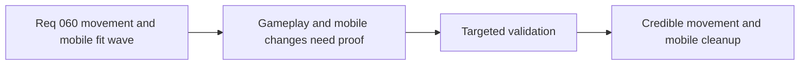

## item_227_define_targeted_validation_for_movement_inertia_and_mobile_shell_fit - Define targeted validation for movement inertia and mobile shell fit
> From version: 0.5.0
> Status: Done
> Understanding: 100%
> Confidence: 98%
> Progress: 100%
> Complexity: Medium
> Theme: Quality
> Reminder: Update status/understanding/confidence/progress and linked task references when you edit this doc.

# Problem
- This wave changes both gameplay feel and mobile shell usability, so weak validation would make regressions easy to miss.
- The project needs explicit checks for reversal-feel improvement, mobile bottom-edge visibility, and settings-surface cleanup.
- Without a targeted validation slice, the wave risks landing with only subjective claims.

# Scope
- In: defining targeted automated and manual validation for movement reversal feel, mobile viewport fit, and mobile settings cleanup.
- In: keeping the evidence lightweight and repo-native.
- Out: full performance profiling, analytics-heavy validation, or broad device-lab coverage.

# Acceptance criteria
- AC1: The slice defines targeted validation for movement reversal behavior and bounded drift feel.
- AC2: The slice defines targeted validation for non-PWA mobile viewport fit and bottom-edge visibility.
- AC3: The slice defines targeted validation that desktop-control settings are hidden on mobile and remain available on desktop.
- AC4: The slice keeps validation lightweight relative to the wave scope.
- AC5: The slice defines manual UI validation that shell and settings changes still read coherently after implementation with `logics-ui-steering`.

# AC Traceability
- AC1 -> Scope: movement-feel changes are checked. Proof target: tests where practical plus manual runtime verification.
- AC2 -> Scope: mobile fit is checked. Proof target: mobile viewport verification.
- AC3 -> Scope: settings cleanup is checked across mobile and desktop. Proof target: UI verification and tests where practical.
- AC4 -> Scope: validation remains bounded. Proof target: command list and explicit exclusions.
- AC5 -> Scope: UI coherence is checked after `logics-ui-steering` guided changes. Proof target: manual shell/settings review notes.

# Request AC Traceability
- req_060_define_a_smoother_movement_inertia_and_mobile_shell_fit_wave coverage: AC1, AC2, AC3, AC4, AC5. Proof: `item_227_define_targeted_validation_for_movement_inertia_and_mobile_shell_fit` remains the request-closing backlog slice for `req_060_define_a_smoother_movement_inertia_and_mobile_shell_fit_wave` and stays linked to `task_052_orchestrate_movement_inertia_and_mobile_shell_fit_cleanup` for delivered implementation evidence.

# Decision framing
- Product framing: Required
- Product signals: feel, usability, presentation quality
- Product follow-up: validate that `logics-ui-steering` guidance was reflected in the shell/settings result, not only in technical correctness.
- Architecture framing: Optional
- Architecture signals: runtime and boundaries
- Architecture follow-up: None.

# Links
- Product brief(s): `prod_001_minimal_overlay_and_feedback_for_early_runtime`, `prod_003_high_density_top_down_survival_action_direction`
- Architecture decision(s): `adr_033_adopt_deterministic_movement_oriented_pseudo_physics_instead_of_a_full_physics_engine`
- Request: `req_060_define_a_smoother_movement_inertia_and_mobile_shell_fit_wave`
- Primary task(s): `task_052_orchestrate_movement_inertia_and_mobile_shell_fit_cleanup`

# References
- `logics/request/req_060_define_a_smoother_movement_inertia_and_mobile_shell_fit_wave.md`

# Priority
- Impact: Medium
- Urgency: High

# Notes
- Derived from request `req_060_define_a_smoother_movement_inertia_and_mobile_shell_fit_wave`.
- Source file: `logics/request/req_060_define_a_smoother_movement_inertia_and_mobile_shell_fit_wave.md`.
