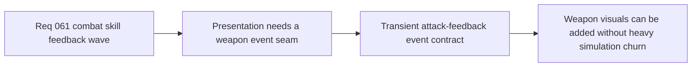

## item_228_define_a_transient_attack_feedback_event_contract_for_first_wave_playable_weapons - Define a transient attack-feedback event contract for first-wave playable weapons
> From version: 0.4.0
> Status: Done
> Understanding: 100%
> Confidence: 98%
> Progress: 100%
> Complexity: Medium
> Theme: Architecture
> Reminder: Update status/understanding/confidence/progress and linked task references when you edit this doc.

# Problem
- The first playable weapon roster exists in simulation, but the runtime still lacks a compact contract that can hand weapon activity to presentation in a readable form.
- Without a dedicated event seam, weapon visuals risk being hardcoded into combat rules or deferred into a much heavier projectile rewrite.
- The project needs one bounded substrate for transient skill feedback before layering weapon-specific visuals.

# Scope
- In: defining a transient attack-feedback event contract that can carry first-wave weapon identity, source, timing, and target or impact information into presentation.
- In: keeping the contract small and renderer-friendly.
- In: aligning the contract with the current deterministic combat path rather than replacing that path.
- Out: full persistent projectile simulation or a generalized combat-event bus for every future mechanic.

# Acceptance criteria
- AC1: The slice defines a compact attack-feedback event contract for first-wave playable weapons.
- AC2: The slice carries enough data for readable weapon rendering without requiring persistent projectile entities for every weapon.
- AC3: The slice keeps gameplay resolution authoritative in the current combat simulation.
- AC4: The slice stays bounded to first-wave weapon feedback needs and does not widen into a broad generic combat event architecture.

# AC Traceability
- AC1 -> Scope: attack-feedback event shape exists. Proof target: runtime contract or event-type definitions.
- AC2 -> Scope: presentation data is sufficient but bounded. Proof target: fields for weapon identity, origin, timing, and target/impact posture.
- AC3 -> Scope: simulation authority remains intact. Proof target: event emission occurs after or alongside combat resolution rather than replacing it.
- AC4 -> Scope: architecture stays bounded. Proof target: explicit exclusions and limited file scope.

# Decision framing
- Product framing: Required
- Product signals: readability, weapon learning, feedback clarity
- Product follow-up: None.
- Architecture framing: Required
- Architecture signals: runtime and boundaries
- Architecture follow-up: keep the seam compatible with `adr_042`.

# Links
- Product brief(s): `prod_011_techno_shinobi_combat_skill_feedback_direction_for_first_playable_weapons`
- Architecture decision(s): `adr_042_separate_weapon_simulation_from_transient_combat_skill_feedback_presentation`
- Request: `req_061_define_a_first_combat_skill_feedback_wave_for_playable_weapons`
- Primary task(s): `task_053_orchestrate_the_first_playable_combat_skill_feedback_wave`

# References
- `logics/product/prod_011_techno_shinobi_combat_skill_feedback_direction_for_first_playable_weapons.md`
- `logics/architecture/adr_042_separate_weapon_simulation_from_transient_combat_skill_feedback_presentation.md`
- `logics/request/req_061_define_a_first_combat_skill_feedback_wave_for_playable_weapons.md`

# Priority
- Impact: High
- Urgency: High

# Notes
- Derived from request `req_061_define_a_first_combat_skill_feedback_wave_for_playable_weapons`.
- Source file: `logics/request/req_061_define_a_first_combat_skill_feedback_wave_for_playable_weapons.md`.
- Implemented through `games/emberwake/src/runtime/entitySimulation.ts` and `games/emberwake/src/runtime/entitySimulationCombat.ts` with bounded `combatSkillFeedbackEvents` emitted alongside authoritative combat resolution.
