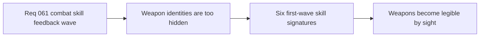

## item_230_define_readable_first_pass_techno_shinobi_skill_signatures_for_the_six_playable_active_weapons - Define readable first-pass techno-shinobi skill signatures for the six playable active weapons
> From version: 0.4.0
> Status: Draft
> Understanding: 98%
> Confidence: 97%
> Progress: 0%
> Complexity: High
> Theme: Gameplay
> Reminder: Update status/understanding/confidence/progress and linked task references when you edit this doc.

# Problem
- The six first-wave active weapons now differ in gameplay role, but that difference is still weak on screen.
- The project needs one bounded slice that turns those six weapons into six visually distinct combat signatures.
- Without this slice, the first build loop remains mechanically broader than it feels.

# Scope
- In: defining readable first-pass signatures for `Ash Lash`, `Guided Senbon`, `Shade Kunai`, `Cinder Arc`, `Orbit Sutra`, and `Null Canister`.
- In: aligning those signatures with the techno-shinobi language.
- In: keeping the feedback role-first and readable under swarm pressure.
- Out: final VFX polish, audio pass, or late-game spectacle tuning.

# Acceptance criteria
- AC1: The slice defines a distinct readable signature for each of the six first-wave active weapons.
- AC2: The slice keeps those signatures aligned with their intended gameplay roles.
- AC3: The slice keeps the visual language techno-shinobi rather than generic cyber-neon or fantasy spell haze.
- AC4: The slice keeps readability above spectacle in the first pass.

# AC Traceability
- AC1 -> Scope: six signatures exist. Proof target: runtime feedback implementations for all six actives.
- AC2 -> Scope: signatures reinforce role identity. Proof target: per-weapon presentation notes and runtime verification.
- AC3 -> Scope: theme posture is preserved. Proof target: shape and color language choices.
- AC4 -> Scope: first pass remains readable. Proof target: manual verification under normal runtime pressure.

# Decision framing
- Product framing: Required
- Product signals: readability, feedback, build learning
- Product follow-up: None.
- Architecture framing: Optional
- Architecture signals: runtime and boundaries
- Architecture follow-up: keep this slice on top of the attack-feedback event seam rather than bypassing it.

# Links
- Product brief(s): `prod_010_first_playable_techno_shinobi_build_content_and_progression_defaults`, `prod_011_techno_shinobi_combat_skill_feedback_direction_for_first_playable_weapons`
- Architecture decision(s): `adr_042_separate_weapon_simulation_from_transient_combat_skill_feedback_presentation`
- Request: `req_061_define_a_first_combat_skill_feedback_wave_for_playable_weapons`
- Primary task(s): `task_053_orchestrate_the_first_playable_combat_skill_feedback_wave`

# References
- `logics/product/prod_010_first_playable_techno_shinobi_build_content_and_progression_defaults.md`
- `logics/product/prod_011_techno_shinobi_combat_skill_feedback_direction_for_first_playable_weapons.md`
- `logics/request/req_061_define_a_first_combat_skill_feedback_wave_for_playable_weapons.md`

# Priority
- Impact: High
- Urgency: High

# Notes
- Derived from request `req_061_define_a_first_combat_skill_feedback_wave_for_playable_weapons`.
- Source file: `logics/request/req_061_define_a_first_combat_skill_feedback_wave_for_playable_weapons.md`.
