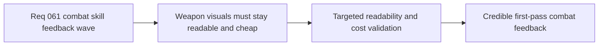

## item_232_define_targeted_validation_for_first_wave_weapon_feedback_readability_and_runtime_cost - Define targeted validation for first-wave weapon feedback readability and runtime cost
> From version: 0.5.0
> Status: Done
> Understanding: 100%
> Confidence: 98%
> Progress: 100%
> Complexity: Medium
> Theme: Quality
> Reminder: Update status/understanding/confidence/progress and linked task references when you edit this doc.

# Problem
- Adding readable weapon feedback improves combat expression, but it can also regress performance or create unreadable clutter.
- The project needs one bounded validation slice that checks both readability and runtime cost.
- Without this slice, the first weapon-feedback wave risks landing as either noisy or too expensive.

# Scope
- In: defining targeted validation for weapon-signature readability, fusion payoff visibility, and transient-render runtime cost.
- In: covering manual and automated checks where practical.
- In: keeping validation repo-native and bounded.
- Out: full benchmarking infrastructure or cinematic VFX approval workflows.

# Acceptance criteria
- AC1: The slice defines targeted validation for first-wave weapon readability in runtime conditions.
- AC2: The slice defines validation for visible fusion payoff.
- AC3: The slice defines runtime-cost checks so the transient feedback layer does not obviously regress the current performance posture.
- AC4: The slice keeps validation bounded and repo-native.

# AC Traceability
- AC1 -> Scope: readability checks exist. Proof target: manual or scripted validation notes.
- AC2 -> Scope: fusion payoff is explicitly reviewed. Proof target: fused-state verification steps.
- AC3 -> Scope: runtime-cost guardrails are included. Proof target: profiling/smoke commands and notes.
- AC4 -> Scope: validation remains lightweight. Proof target: bounded command list.

# Request AC Traceability
- req_061_define_a_first_combat_skill_feedback_wave_for_playable_weapons coverage: AC1, AC2, AC3, AC4, AC5. Proof: `item_232_define_targeted_validation_for_first_wave_weapon_feedback_readability_and_runtime_cost` remains the request-closing backlog slice for `req_061_define_a_first_combat_skill_feedback_wave_for_playable_weapons` and stays linked to `task_053_orchestrate_the_first_playable_combat_skill_feedback_wave` for delivered implementation evidence.

# Decision framing
- Product framing: Required
- Product signals: readability, payoff, responsiveness
- Product follow-up: None.
- Architecture framing: Optional
- Architecture signals: runtime and render budget
- Architecture follow-up: preserve compatibility with current runtime performance validation.

# Links
- Product brief(s): `prod_011_techno_shinobi_combat_skill_feedback_direction_for_first_playable_weapons`
- Architecture decision(s): `adr_028_budget_player_runtime_and_debug_visuals_as_separate_render_modes`, `adr_042_separate_weapon_simulation_from_transient_combat_skill_feedback_presentation`
- Request: `req_061_define_a_first_combat_skill_feedback_wave_for_playable_weapons`
- Primary task(s): `task_053_orchestrate_the_first_playable_combat_skill_feedback_wave`

# References
- `logics/product/prod_011_techno_shinobi_combat_skill_feedback_direction_for_first_playable_weapons.md`
- `logics/request/req_061_define_a_first_combat_skill_feedback_wave_for_playable_weapons.md`

# Priority
- Impact: High
- Urgency: Medium

# Notes
- Derived from request `req_061_define_a_first_combat_skill_feedback_wave_for_playable_weapons`.
- Source file: `logics/request/req_061_define_a_first_combat_skill_feedback_wave_for_playable_weapons.md`.
- Validation executed with `npm run test -- entitySimulation gameplaySystems emberwakeRuntimeIntegration`, `npm run typecheck`, `npm run ci`, `npm run test:browser:smoke`, and a manual preview run using invincible profiling config to verify live-render feedback.
