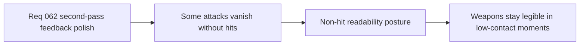

## item_233_define_a_non_hit_readability_posture_for_polished_weapon_feedback - Define a non-hit readability posture for polished weapon feedback
> From version: 0.4.0
> Status: Draft
> Understanding: 99%
> Confidence: 98%
> Progress: 0%
> Complexity: Medium
> Theme: Gameplay
> Reminder: Update status/understanding/confidence/progress and linked task references when you edit this doc.

# Problem
- Some first-wave weapon feedback still disappears too completely when no immediate target is resolved.
- This makes certain attacks feel visually absent in low-contact or pre-contact moments.
- The project needs a bounded posture for non-hit readability without making every attack noisy.

# Scope
- In: defining where attempt-time or non-hit feedback is warranted.
- In: keeping those cues bounded and role-specific.
- Out: adding visible attempt feedback to every weapon indiscriminately.

# Acceptance criteria
- AC1: The slice defines when non-hit readability cues are allowed.
- AC2: The slice keeps those cues bounded and role-appropriate.
- AC3: The slice avoids widening into universal attempt spam across the whole roster.

# Links
- Product brief(s): `prod_012_second_pass_combat_skill_feedback_polish_for_underexpressed_weapons`
- Architecture decision(s): `adr_043_extend_transient_weapon_feedback_with_bounded_anticipation_and_linger_states`
- Request: `req_062_define_a_second_combat_skill_feedback_polish_wave_for_underexpressed_weapons`

# Notes
- Derived from request `req_062_define_a_second_combat_skill_feedback_polish_wave_for_underexpressed_weapons`.
