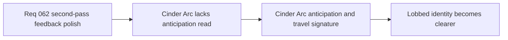

## item_234_define_a_stronger_cinder_arc_anticipation_and_travel_signature_without_full_projectiles - Define a stronger Cinder Arc anticipation and travel signature without full projectiles
> From version: 0.4.0
> Status: Draft
> Understanding: 99%
> Confidence: 98%
> Progress: 0%
> Complexity: Medium
> Theme: Gameplay
> Reminder: Update status/understanding/confidence/progress and linked task references when you edit this doc.

# Problem
- `Cinder Arc` currently communicates impact better than anticipation.
- Its lobbed identity is still under-taught before the detonation.

# Scope
- In: bounded anticipation and travel cues for `Cinder Arc`.
- In: preserving the current transient posture.
- Out: converting `Cinder Arc` into a fully simulated persistent projectile system.

# Acceptance criteria
- AC1: The slice defines a clearer pre-impact read for `Cinder Arc`.
- AC2: The slice keeps the effect transient and bounded.
- AC3: The slice avoids widening into a full projectile rewrite.

# Links
- Product brief(s): `prod_012_second_pass_combat_skill_feedback_polish_for_underexpressed_weapons`
- Architecture decision(s): `adr_043_extend_transient_weapon_feedback_with_bounded_anticipation_and_linger_states`
- Request: `req_062_define_a_second_combat_skill_feedback_polish_wave_for_underexpressed_weapons`

# Notes
- Derived from request `req_062_define_a_second_combat_skill_feedback_polish_wave_for_underexpressed_weapons`.
