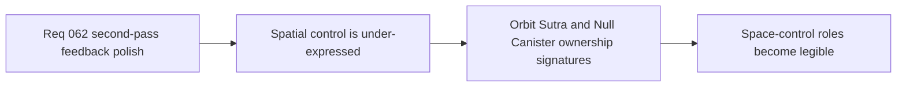

## item_235_define_a_more_present_orbit_sutra_and_null_canister_spatial_ownership_signature - Define a more present Orbit Sutra and Null Canister spatial ownership signature
> From version: 0.4.0
> Status: Done
> Understanding: 100%
> Confidence: 98%
> Progress: 100%
> Complexity: Medium
> Theme: Gameplay
> Reminder: Update status/understanding/confidence/progress and linked task references when you edit this doc.

# Problem
- `Orbit Sutra` and `Null Canister` still under-communicate owned space.
- Their role as perimeter/field-control tools is not yet strong enough on screen.

# Scope
- In: stronger spatial presence for `Orbit Sutra` and `Null Canister`.
- In: bounded occupancy cues and short-lived field/read markers.
- Out: permanent heavy persistent VFX layers.

# Acceptance criteria
- AC1: The slice defines stronger spatial ownership reads for both weapons.
- AC2: The slice keeps those reads bounded and readable.
- AC3: The slice keeps the techno-shinobi field language disciplined.

# Links
- Product brief(s): `prod_012_second_pass_combat_skill_feedback_polish_for_underexpressed_weapons`
- Architecture decision(s): `adr_043_extend_transient_weapon_feedback_with_bounded_anticipation_and_linger_states`
- Request: `req_062_define_a_second_combat_skill_feedback_polish_wave_for_underexpressed_weapons`

# Notes
- Derived from request `req_062_define_a_second_combat_skill_feedback_polish_wave_for_underexpressed_weapons`.
