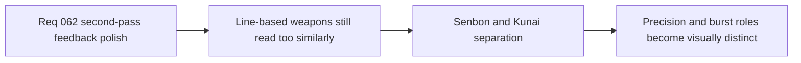

## item_236_define_clearer_visual_role_separation_between_guided_senbon_and_shade_kunai - Define clearer visual role separation between Guided Senbon and Shade Kunai
> From version: 0.4.0
> Status: Draft
> Understanding: 99%
> Confidence: 98%
> Progress: 0%
> Complexity: Medium
> Theme: Gameplay
> Reminder: Update status/understanding/confidence/progress and linked task references when you edit this doc.

# Problem
- `Guided Senbon` and `Shade Kunai` both currently rely on line-based attack reads.
- Their difference in role is stronger in gameplay than on screen.

# Scope
- In: stronger silhouette/cadence separation between precision and forward-burst signatures.
- In: preserving both weapons inside the transient feedback family.
- Out: redesigning the weapons’ gameplay roles.

# Acceptance criteria
- AC1: The slice defines clearer role separation between the two weapons.
- AC2: The slice preserves the techno-shinobi feedback family.
- AC3: The slice improves readability without requiring heavy new architecture.

# Links
- Product brief(s): `prod_012_second_pass_combat_skill_feedback_polish_for_underexpressed_weapons`
- Architecture decision(s): `adr_043_extend_transient_weapon_feedback_with_bounded_anticipation_and_linger_states`
- Request: `req_062_define_a_second_combat_skill_feedback_polish_wave_for_underexpressed_weapons`

# Notes
- Derived from request `req_062_define_a_second_combat_skill_feedback_polish_wave_for_underexpressed_weapons`.
