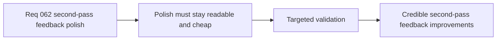

## item_237_define_targeted_validation_for_second_pass_weapon_feedback_polish - Define targeted validation for second-pass weapon feedback polish
> From version: 0.5.0
> Status: Done
> Understanding: 100%
> Confidence: 98%
> Progress: 100%
> Complexity: Medium
> Theme: Quality
> Reminder: Update status/understanding/confidence/progress and linked task references when you edit this doc.

# Problem
- Second-pass feedback polish can improve clarity, but also add noise or budget regressions.
- The project needs bounded validation for the specific readability gains this wave targets.

# Scope
- In: targeted checks for non-hit readability, spatial ownership, and weapon differentiation.
- In: bounded runtime-cost checks.
- Out: full benchmark infrastructure.

# Acceptance criteria
- AC1: The slice defines targeted readability checks for the under-expressed weapons.
- AC2: The slice defines differentiation checks for `Guided Senbon` and `Shade Kunai`.
- AC3: The slice includes bounded runtime-cost validation.

# Request AC Traceability
- req_062_define_a_second_combat_skill_feedback_polish_wave_for_underexpressed_weapons coverage: AC1, AC2, AC3, AC4, AC5. Proof: `item_237_define_targeted_validation_for_second_pass_weapon_feedback_polish` remains the request-closing backlog slice for `req_062_define_a_second_combat_skill_feedback_polish_wave_for_underexpressed_weapons` and stays linked to `task_054_orchestrate_post_0_4_0_runtime_expression_and_progression_waves` for delivered implementation evidence.

# Links
- Product brief(s): `prod_012_second_pass_combat_skill_feedback_polish_for_underexpressed_weapons`
- Architecture decision(s): `adr_043_extend_transient_weapon_feedback_with_bounded_anticipation_and_linger_states`
- Request: `req_062_define_a_second_combat_skill_feedback_polish_wave_for_underexpressed_weapons`

# Notes
- Derived from request `req_062_define_a_second_combat_skill_feedback_polish_wave_for_underexpressed_weapons`.
